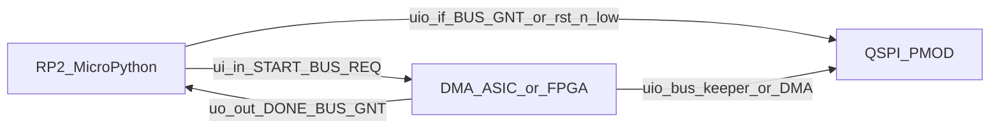

# Firmware Architecture

MicroPython firmware for the Tiny Tapeout demoboard (RP2 MCU) that programs this DMA: bus ownership, SPI PSRAM bring-up, TCD install on both devices, debug helpers, and demoboard demos / M7. Decision: **D30**. Verbose twin: [`../../llm/12-firmware.md`](../../llm/12-firmware.md). TCD field detail: [`blocks/tcd.md`](blocks/tcd.md). Pin-level host protocol: [`blocks/host-interface.md`](blocks/host-interface.md).

## Purpose / scope

- **In scope:** demoboard MCU software for V1 bulk memcpy (dual PSRAM, 11-byte TCDs, `QUIT` end-of-chain). Lives under a proposed `firmware/` tree on the host / MCU filesystem; not under cocotb `test/` (D30).
- **Runtime:** MicroPython on the **TT ETR demoboard (RP2350B)** via the local [`tt-micropython-firmware/`](../../../tt-micropython-firmware/) SDK (`DemoBoard`). Upstream: TinyTapeout/tt-micropython-firmware.
- **PMOD SPI groundwork:** Tiny Tapeout QSPI PMOD guide ([PDF](../../datasheets/pdfs/Using_QSPI_TinyTapeout.pdf), [extracted notes + code catalog](../../datasheets/md/Using_QSPI_TinyTapeout.md)).
- **Out of scope here:** cocotb ASIC tests, IHP PDK / LibreLane template docs as MCU APIs, and TinyDMA-2C UART FPGA scripts (prior art only; do not copy).

## Platform stack

| Piece | Role |
|---|---|
| UF2 SDK image | Install MicroPython + `ttboard` on the demoboard RP2 (boot-button + USB) |
| `DemoBoard` (`tt`) | Project mux enable, `ui_in` / `uo_out` / `uio_*`, clock, `rst_n` |
| `config.ini` | Mode, default project, clocks, optional per-project `uio_oe_pico` / `ui_in` |
| Modes | `SAFE` (all RP pins inputs); `ASIC_RP_CONTROL` (MCU drives inputs/clock/reset, monitors outputs - normal for this project); `ASIC_MANUAL_INPUTS` (manual switches) |
| `mpremote` | Copy files to/from the MicroPython filesystem; `mpremote reset` after config changes |
| FPGA path (M7) | Optional FPGA ASIC stand-in: place `.bin` under `/bitstreams`; load via `tt.shuttle` like a design |

IHP clones (`ttihp-verilog-template/`, `IHP-Open-PDK/`) are not MCU architecture sources.

## Board / pin model

| Plane | Pins | Firmware use |
|---|---|---|
| Inputs (`ui_in`) | `[0]=START`, `[2]=BUS_REQ`; `[1]` and `[7:3]` unused (drive 0; D34) | Assert levels; hold START long enough for the ASIC input synchronizer |
| Outputs (`uo_out`) | `[0]=DONE`, `[1]=BUS_GNT`; `[7:2]` unused (tied 0; D34) | Poll idle and grant only |
| Bidirectional (`uio`) | QSPI PMOD: flash CS, SIO0..3, SCK, RAM A/B CS (see [`system.md`](system.md)) | Drive while `BUS_GNT=1` or `rst_n=0` (D26) |

MCU QSPI OE is **separate** from ASIC `uio_oe`. SDK `uio_oe_pico`: bits set to **1** are driven by the RP2; keep all bits **0** (Hi-Z) unless `BUS_GNT=1` or `rst_n=0`, and clear OE before dropping `BUS_REQ`.

ETR BIDIR map (`uio[0..7]` → GPIO25..32): flash CS, MOSI, MISO, SCK, SD2, SD3, RAM A CS, RAM B CS. Full table + PIO examples: [`../../datasheets/md/Using_QSPI_TinyTapeout.md`](../../datasheets/md/Using_QSPI_TinyTapeout.md).

## Bring-up

Ordered demoboard sequence (ASIC or M7 FPGA stand-in):

1. Enable this design (`tt.shuttle.<name>.enable()` or load bitstream under `/bitstreams`).
2. Set project clock ≈ **66 MHz** (D16); leave `rst_n` controlled by the SDK.
3. Deassert `rst_n`; confirm `DONE=1` and `BUS_GNT=0` (ASIC parks CS high / SCK low - D26).
4. Park MCU QSPI OE Hi-Z while `rst_n=1` and `~BUS_GNT`; drive only under grant (or while held in reset if talking to the PMOD with this design deselected).
5. Follow bus ownership + SPI bring-up + TCD install below, then pulse START.

## System I/O and bus ownership

1. Keep the MCU QSPI pins high-Z unless `BUS_GNT` is high or `rst_n` is low (D26).
2. To access either PSRAM or flash while this design is live, assert `BUS_REQ`, wait for `BUS_GNT=1`, then enable the MCU QSPI drivers. While `rst_n=0` (including another design selected on the TT mux), MCU drive is also legal without `BUS_GNT`.
3. Before releasing the bus, finish the current transaction, drive every CE# high, make the MCU QSPI pins high-Z, then deassert `BUS_REQ`. Wait for `BUS_GNT=0` before asserting `START`.
4. Initialize both PSRAMs and leave them in QPI mode before `START`. The ASIC does not issue reset, Enter Quad, or Exit Quad commands (D17).
5. Assert `START` only while `DONE=1` and `BUS_REQ=0`. Hold it long enough to cross the input synchronizer, then deassert it. A START edge while busy or while `BUS_REQ=1` is ignored and not queued; firmware must drop request (if any), see `BUS_GNT=0`, and issue a **new** START rising edge.
6. After pulsing `START`, do **not** assert `BUS_REQ` again until `DONE` has fallen. Raising `BUS_REQ` with or after `START` while `DONE` is still high can make the post-sync START pulse lose to `BUS_REQ` in IDLE (ignored, not queued) or accept START and stall immediately at `NEW_FETCH`. `DONE` falling is the firmware ACK that START was accepted.
7. `DONE=1` means the ASIC is idle. It does not grant MCU ownership of `uio`; firmware must still request and receive `BUS_GNT` (unless already in `rst_n=0`).
8. A mid-run `BUS_REQ` pauses the DMA only after its current QPI transaction (at most one in-flight QPI txn of grant latency). To stop a runaway chain, assert `rst_n`; V1 has no soft abort (D23).

### ASIC bus keeper (D26)

While `rst_n=1` and `BUS_GNT=0`, the ASIC owns the shared QSPI nets as a **bus keeper**, including idle and the gaps between DMA transactions:

- Drives **flash CS**, **RAM A CS**, and **RAM B CS** high (deselected). Flash is never selected by the ASIC; parking its CS high is not flash DMA.
- Drives **SCK** low.
- Drives **SIO** with a don't-care in park / IDLE / between transactions **after** the post-CE# `tHZ` window. During dummy/wait, read-data, and through `tHZ`, SIO floats so the selected PSRAM can source (or finish releasing) the bus.

When `BUS_GNT=1`, the ASIC releases every shared `uio` output so the MCU can master the bus. While `rst_n=0`, shared OE is also forced off and this **is** an MCU-safe drive window (alongside grant; not a soft-abort). After grant falls or reset deasserts with `BUS_GNT=0`, the ASIC resumes parking immediately.

Full phase-by-phase ownership (float vs ASIC / MCU / PSRAM drive): [`blocks/host-interface.md`](blocks/host-interface.md) and [`../../llm/03-architecture.md`](../../llm/03-architecture.md).

### Board CS pull-ups

The QSPI PMOD / demoboard path has a **10 kΩ pull-up on each CS** (flash, RAM A, RAM B). Those resistors keep CE# high during `rst_n`, power-up, and any window before the Tiny Tapeout mux enables this design, unless the MCU selects a device. They are a backup; firmware must not rely on them alone while the ASIC is live (`rst_n=1`) and `BUS_GNT=0`.

The handoff rule is always release before seize. Driving the MCU and ASIC outputs at the same time on SIO (or driving opposite CS/SCK levels) causes contention. Brief overlap on the idle levels (CS high / SCK low) is benign if it occurs, but firmware must still Hi-Z before dropping `BUS_REQ` and before `START`.

## SPI PSRAM driver

Firmware is a **basic SPI** master to **both** PSRAM devices (cmd/addr/data on SIO0 / MOSI-MISO style) under a legal drive window (D26/D22). **D30** transport matches the published ETR QSPI PMOD scripts:

| Preference | Detail |
|---|---|
| Primary | **PIO SPI** (`PIOSPI` / `rp2.StateMachine` / `spi_cpha0`) on ETR GPIO25..32 |
| Rates in guide | Default ctor 1 MHz; flash/PSRAM helpers use **10 MHz** |
| CS | Separate GPIO per flash / RAM A / RAM B; all high when idle; never two CE# low |
| Not primary | SoftSPI or hardware `machine.SPI` (guide imports `SPI` but does not use it as master) |
| Reuse | Adapt catalogued `PIOSPI`, CS framing, and PSRAM `0x02`/`0x03` patterns from [`Using_QSPI_TinyTapeout.md`](../../datasheets/md/Using_QSPI_TinyTapeout.md); do not invent a parallel bitbang stack |

The TT SDK exposes ports/OE but does not ship a PSRAM driver. Guide PSRAM tests stay in SPI mode; this project still issues APS6404L reset / Enter Quad (`0x35`) before START (D17). MCU-side QPI / quad I/O for payload is not required (D30).

**Flash QSPI mode:** first-party QSPI Pmods ship with flash Quad Enable already set. V1 firmware does **not** enable or disable flash QSPI (D30). Optional flash access under grant is data/ID/program only; skip QE activation scripts in normal bring-up.

| Opcode | Role (MCU SPI path) |
|---|---|
| `0x03` | SPI read |
| `0x02` | SPI write |
| `0x66` / `0x99` | Reset Enable then Reset (issue Reset immediately after Enable) |
| `0x35` | Enter Quad (SPI → QPI) |
| `0xF5` | Exit Quad (QPI → SPI; after DONE if SPI is needed again) |
| `0x9F` | Read ID (bring-up / diagnostics) |

Bring-up per device DMA will touch: wait `tPU` (≥150 us, CE# high), `0x66`/`0x99`, wait `tRST`, then `0x35`. ASIC expects both devices in QPI before START (D17). MCU-side QPI / quad I/O is **not** required in V1 firmware. Flash remains MCU pass-through under grant; ASIC never selects flash (D11/D26). Full opcode / timing tables: [`../../llm/05-qspi-psram.md`](../../llm/05-qspi-psram.md).

## tCEM / chunking

APS6404L needs CE# high often enough for refresh. MCU SPI bursts must **chunk** long transfers so each CE# low pulse stays under device `tCEM` (see [`../../llm/05-qspi-psram.md`](../../llm/05-qspi-psram.md); not an ASIC buffer-depth rule).

| Constant | Default | Notes |
|---|---|---|
| `TCEM_US` | `4.0` | Extended-grade max CE# low (us) |
| `SPI_CHUNK_BYTES` | `1` | Safe default until chunking is recomputed at the chosen PIO SPI rate (guide helpers use 10 MHz) |

Also respect firmware-facing ASIC limits:

- `TRANSFER_LEN` max **255** per data TCD (chain for more)
- ASIC V1 descriptor copy depth `N=1` (D20): ASIC CE# pulses are short by construction; MCU SPI still chunks
- Valid address range `0x000000..0x7FFFFF` per device on `ptr[22:0]` (`ptr[23]` don't-care; D35)
- Release-before-seize on the shared bus

Chunk-size formula vs SPI SCK: llm twin.

## Writing TCDs

- Every run starts by fetching an 11-byte TCD at `0x000000` on PSRAM 0.
- Serialize TCDs explicitly into an 11-byte buffer. Do not write a native C structure or copy native MCU integers directly.
- Use this exact byte layout: offsets `0..2` are `SRC_PTR[23:16]`, `[15:8]`, `[7:0]`; offsets `3..5` are the same three bytes of `DEST_PTR`; offset `6` is `TRANSFER_LEN`; offsets `7..9` are the three bytes of `NEXT_TCD`; offset `10` is `CTRL_FLAGS`.
- The three 24-bit fields `SRC_PTR`, `DEST_PTR`, and `NEXT_TCD` are stored big-endian: most-significant byte first. For example, `0x123456` is written as `12 34 56` (D25).
- MCU endianness does not affect payload data. Payload bytes are copied unchanged, with no byte swapping.
- `TRANSFER_LEN` and `CTRL_FLAGS` are single-byte fields. One data TCD can request at most 255 bytes; use another linked TCD for additional bytes.
- Set `CTRL_FLAGS.SRC_DEVICE`, `DEST_DEVICE`, and `NEXT_DEVICE` for the corresponding pointer. Device selection is not encoded in a pointer bit (D24).
- Write reserved `CTRL_FLAGS[3:0]` bits as zero (last nibble of the 11-byte TCD). The ASIC latches them (working TCD is 88 bits); V1 control ignores them.
- `TRANSFER_LEN=0` is a no-op that follows `NEXT_TCD`; it does not end the chain.

### TCD install

Under `BUS_GNT`, write serialized 11-byte TCDs (and payloads) into **both** PSRAMs as the chain requires. The fixed head must live at `0x000000` on **PSRAM 0**. Linked descriptors and buffers may sit on either device via `NEXT_DEVICE` / `SRC_DEVICE` / `DEST_DEVICE`. Validate every address range before writing (see below).

## Terminating a transfer chain

Every finite transfer chain must end with a separate TCD whose `CTRL_FLAGS.QUIT` bit is set to `1`. The preceding data TCD must link to this quit TCD through `NEXT_TCD` and `NEXT_DEVICE`.

The ASIC fetches the quit TCD, observes `QUIT=1`, and returns to idle with `DONE=1`. The quit TCD is always a no-op: it performs no source read or destination write, regardless of its pointer or `TRANSFER_LEN` fields, and it does not follow its own `NEXT_TCD`.

Address zero is a valid link and is not a terminator. For an empty run, place the quit TCD directly at the fixed head, `0x000000` on PSRAM 0.

## PSRAM address limits

Each PSRAM has a 23-bit byte address, `A[22:0]`, so its valid range is `0x000000` through `0x7FFFFF` inclusive. Bit 23 of every 24-bit TCD pointer is **don't-care** (may be any value; D35); device select is only in `CTRL_FLAGS`. Use `ptr[22:0]` when checking ranges.

Firmware must validate the complete range of every memory operation before writing or starting a chain:

- An 11-byte TCD fetch is valid only when `(NEXT_TCD & 0x7FFFFF) + 10 <= 0x7FFFFF`. This applies to the fixed head and every linked descriptor.
- For `TRANSFER_LEN > 0`, the source is valid only when `(SRC_PTR & 0x7FFFFF) + TRANSFER_LEN - 1 <= 0x7FFFFF`.
- For `TRANSFER_LEN > 0`, the destination is valid only when `(DEST_PTR & 0x7FFFFF) + TRANSFER_LEN - 1 <= 0x7FFFFF`.
- Perform these checks in a widened integer type so the validation calculation itself cannot wrap.

A TCD whose `A[22:0]` starts outside the valid range, or whose TCD fetch, source range, or destination range crosses `0x7FFFFF`, has **undefined** hardware behavior (D34). Firmware must validate before START.

## Safe programming sequence

1. Request and receive the bus grant.
2. Initialize both PSRAMs into QPI mode (SPI reset + Enter Quad).
3. Stage payloads and a fully validated TCD chain on both devices as needed; head on PSRAM 0.
4. Finish SPI activity, drive CE# high, and make MCU QSPI pins high-Z.
5. Drop `BUS_REQ` and wait for `BUS_GNT=0`.
6. Pulse `START` while `DONE=1`.
7. Wait for `DONE=1`, or use `BUS_REQ` to pause and inspect memory between DMA transactions.
8. Request and receive `BUS_GNT` before the MCU drives QSPI again (SPI dump, Exit Quad `0xF5`, or re-init).

Suggested software memory map (not hardware-enforced): [`system.md`](system.md) logical memory map.

## Debug helpers

First-class firmware APIs (same SPI + grant path):

| Helper | Purpose |
|---|---|
| Dump range | Address range → hex/bytes on either PSRAM |
| Peek / poke | Read or write a few bytes |
| Read ID | Optional `0x9F` for bring-up |
| Decode TCD chain | Walk `NEXT_TCD` / `NEXT_DEVICE` and print fields until `QUIT` |
| Host pins | Assert/deassert `BUS_REQ`, poll `DONE`/`BUS_GNT`, pulse `START`, assert `rst_n` kill |

## Module layout (proposed)

Documented package split; Python not created by this architecture note alone.

| Path | Role |
|---|---|
| `firmware/bus.py` | `BUS_REQ`/`BUS_GNT`, Hi-Z / OE, START pulse, `rst_n` |
| `firmware/psram_spi.py` | ETR `PIOSPI` (adapt from QSPI guide catalog), CS mux, opcodes, `tCEM` chunking |
| `firmware/tcd.py` | Pack / unpack / validate 11-byte TCDs and chains |
| `firmware/debug.py` | Dump, peek/poke, chain decode |
| `firmware/demo_*.py` | Min demos and M7 scripts |
| `firmware/tests/` | Host-side pytest of pure logic (no demoboard) |

Keep `ttboard` imports out of pure helpers where practical so PC unit tests can import without hardware.

## Firmware logic testbench

PC **pytest** under `firmware/tests/` (D30) exercises pack/validate/`QUIT` chains, SPI frame builders, `tCEM` chunking, dump/format helpers, and address-range checks **without** demoboard hardware. It can start before demoboard bring-up. It is not a substitute for Phase 3 / M7 HIL.

## Demos / M7

After the cocotb/RTL verification milestones that gate M7 entry are complete, FPGA testing must be ready to run. That requires demoboard/FPGA bring-up including this firmware library, so firmware work is allowed and needed before or as M7 starts (not deferred until after M7). Demoboard HIL remains Phase 3 / M7.

- **Min demo:** grant → SPI init both PSRAMs → install head + `QUIT` (or short copy) → START → wait DONE → dump dest.
- **M7 subset** (FPGA stand-in + real dual PSRAM; D28 / verification strategy): same-device copies, both cross-device directions, chaining, `QUIT`, zero-length, bus handoff, reset recovery. Retain scripts tied to the RTL revision validated. M7 does not close physical `T-*` rows.

## Recovery

On DONE timeout or runaway chain: assert `rst_n` (D23), release MCU OE, then under grant re-run SPI reset + Enter Quad on both devices before the next START. There is no ERROR status pin (D34); poll **DONE** and validate chains in firmware before START.

## Sim relationship

Demoboard firmware is **not** [`../../../test/common/host.py`](../../../test/common/host.py). Cocotb host helpers share programming intent (grant, START, TCD rules) but live in a separate tree for ASIC simulation. Do not treat sim helpers as MicroPython APIs.

## Non-goals (V1 firmware)

- No MCU-side QPI or quad I/O requirement (basic SPI only)
- No ASIC flash DMA, ALU, cond-stop, or ring (kill = `rst_n`, D23)
- No soft abort pin or soft-abort path (kill with `rst_n` only)
- No copying TinyDMA-2C UART FPGA firmware design

**Self-pointing TCD (D35):** a descriptor may point `NEXT_TCD` at itself (or form a cycle). Without `QUIT`, the DMA spins until `rst_n`. Prefer finite `QUIT`-terminated chains for normal demoboard runs.
