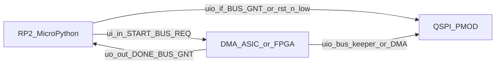

# Firmware Architecture

MicroPython firmware for the Tiny Tapeout demoboard (RP2 MCU) that programs TinyDMA: bus ownership, PSRAM reset + Enter/Exit Quad, QPI install/dump on both devices, debug helpers, and a persistent session for host-driven HIL. Decisions: **D30** (MCU data path is QPI after enter; `0xF5` exit supported; no `test/` imports on the MCU tree), **D37** (three-layer refactor; golden oracle and directed `TC-*` on the host under `hil/`). Verbose twin: [`../../llm/12-firmware.md`](../../llm/12-firmware.md). TCD field detail: [`blocks/tcd.md`](blocks/tcd.md). Pin-level host protocol: [`blocks/host-interface.md`](blocks/host-interface.md).

## Purpose / scope

- **In scope:** demoboard MCU software for V1 bulk memcpy (dual PSRAM, 11-byte TCDs, `QUIT` end-of-chain). Lives under `firmware/` on the host / MCU filesystem; cocotb sim under `test/`; M7 regression orchestrated by host pytest under `hil/`.
- **Runtime:** MicroPython on the **TT ETR demoboard (RP2350B)** via the local [`tt-micropython-firmware/`](../../../tt-micropython-firmware/) SDK (`DemoBoard`). Dual-runtime: the same tree imports on CPython for `firmware/tests/` pytest. No `typing` runtime deps.
- **PMOD groundwork:** Tiny Tapeout QSPI PMOD guide ([PDF](../../datasheets/pdfs/Using_QSPI_TinyTapeout.pdf), [extracted notes + code catalog](../../datasheets/md/Using_QSPI_TinyTapeout.md)). 1-bit PIO SPI plus four-wire QPI, attributed to Rohan Verma / TT guide.
- **Out of scope here:** cocotb ASIC tests, IHP PDK / LibreLane template docs as MCU APIs, TinyDMA-2C UART FPGA scripts (prior art only; do not copy), golden oracle or per-`TC-*` catalogs under `firmware/`, and any import of `test/` from firmware or firmware tests.

## Platform stack

| Piece | Role |
|---|---|
| UF2 SDK image | One-time OS: hold boot, copy a TinyTapeout/tt-micropython-firmware release UF2 (MicroPython + `ttboard` + default `config.ini`) |
| `mpremote` | Copy this repo's tree (`mpremote fs cp -r firmware :/firmware`) then `mpremote reset`. There is no compile of this project's Python |
| `DemoBoard` (`tt`) | Project mux enable, `ui_in` / `uo_out` / `uio_*`, clock, `rst_n` |
| `config.ini` | ASIC default uses `ASIC_RP_CONTROL`; an auto-detected FPGA starts in manual-input mode and TinyDMA switches it to RP control before use |
| FPGA path (M7) | `python -m hil bitstream` then `python -m hil upload`; or just `pytest hil/tests/ --target=fpga`, which builds and uploads first. `.bin` under `/bitstreams`; enable via `tt.shuttle`. Not `test/Makefile` / not GHA. Walkthrough: [`../verification/fpga.md`](../verification/fpga.md) |
| Host HIL (`hil/`) | `python -m hil --target=...` or `pytest hil/tests/ --target=...` against `loopback`, `fpga`, or `asic` |

IHP clones (`ttihp-verilog-template/`, `IHP-Open-PDK/`) are not MCU architecture sources. Do not vendor the SDK into `firmware/`.

## Board / pin model

| Plane | Pins | Firmware use |
|---|---|---|
| Inputs (`ui_in`) | `[0]=START`, `[2]=BUS_REQ`; `[1]` and `[7:3]` unused (drive 0; D34) | Assert levels; GPIO write duration covers the ASIC input synchronizer |
| Outputs (`uo_out`) | `[0]=DONE`, `[1]=BUS_GNT` (bus grant: MCU may drive shared QSPI while high); `[7:2]` unused (tied 0; D34) | Poll idle and grant only |
| Bidirectional (`uio`) | QSPI PMOD: flash CS, SIO0..3, SCK, RAM A/B CS (see [`system.md`](system.md)) | Drive while `BUS_GNT=1` or `rst_n=0` (D26) |

MCU QSPI OE is **separate** from ASIC `uio_oe`. SDK `uio_oe_pico`: bits set to **1** are driven by the RP2; keep all bits **0** (Hi-Z) unless `BUS_GNT=1` or `rst_n=0`, and clear OE before dropping `BUS_REQ`.

ETR BIDIR map (`uio[0..7]` -> GPIO25..32): flash CS, MOSI, MISO, SCK, SD2, SD3, RAM A CS, RAM B CS. Full table + PIO examples: [`../../datasheets/md/Using_QSPI_TinyTapeout.md`](../../datasheets/md/Using_QSPI_TinyTapeout.md).

## Bring-up

Ordered demoboard sequence (ASIC or M7 FPGA stand-in):

1. Enable this design (`tt.shuttle.tt_um_lahnb_sgdma.enable()` or load a bitstream under `/bitstreams`). `session.enable_project` (via `Board`) holds `ui_in=0`, asserts `rst_n`, muxes, clocks the ASIC at **66 MHz** (D16) or the FPGA at its `TT_FPGA_FREQ` constraint (12 MHz by default), deasserts `rst_n`, and samples `DONE=1` / `BUS_GNT=0`.
2. Park MCU QSPI OE Hi-Z while `rst_n=1` and `~BUS_GNT`. `rst_n_low` is Board-recorded `reset_project` state (DemoBoard has no `_in_reset`).
3. `session.bring_up_psram()`: grant bus, SPI reset + Enter Quad on both PSRAMs (or skip SPI if the session flag says already QPI), then release. Host HIL QPI-installs, peeks the head TCD, START, dump, compare against `interpret_chain` (default tapeout `N=5`). The HIL `session` fixture teardown is MCU Hi-Z only (`shutdown()` with `exit_qpi=False`); it does not issue Exit Quad `0xF5` or SPI-reset the chips.

**REPL:** `import firmware.session as session; session.init(); session.enable_project(); session.bring_up_psram()`. **Automated:** `pytest hil/tests/ --target=...` or `python -m hil --target=...` (see Host HIL below). Interactive inspection: `firmware.debug` after grant.

## System I/O and bus ownership

1. Keep the MCU QSPI pins high-Z unless `BUS_GNT` is high or `rst_n` is low (D26).
2. To access either PSRAM or flash while this design is live, assert `BUS_REQ`, wait for `BUS_GNT=1`, then enable the MCU QSPI drivers. While `rst_n=0` (including another design selected on the TT mux), MCU drive is also legal without `BUS_GNT`.
3. Before releasing the bus, finish the current transaction, drive every CE# high, make the MCU QSPI pins high-Z, then deassert `BUS_REQ`. Wait for `BUS_GNT=0` before asserting `START`.
4. Initialize both PSRAMs and leave them in QPI mode before `START`. The ASIC does not issue reset, Enter Quad, or Exit Quad commands (D17). MCU firmware still issues `0x35` / `0xF5` / `0x66` / `0x99`.
5. Assert `START` only while `DONE=1` and `BUS_REQ=0`. Hold START **low across `rst_n` kill / reset release**; GPIO writes hold the pad across the two-flop synchronizer; do not insert a 1 us sleep as the capture mechanism. A START edge while busy or while `BUS_REQ=1` is ignored and not queued.
6. After pulsing `START`, call `wait_idle_after_start` before `BUS_REQ`. If `DONE` is observed low, wait until it is high again. If `DONE` stays high (about 1.2 us for a head `QUIT` fetch), treat that as already idle. Dump/compare on the host is the backstop if START was ignored.
7. `DONE=1` means the ASIC is idle. It does not grant MCU ownership of `uio`.
8. A mid-run `BUS_REQ` pauses the DMA only after its current QPI transaction. To stop a runaway chain, assert `rst_n`; V1 has no soft abort (D23).

Helpers live in `firmware/dma.py` (`DmaController`) on `firmware/board/board.py` (`Board`): `enable_project`, `reset_dma` (clears `ui_in` so `BUS_REQ` cannot stick), `request_bus` / `release_bus`, `pulse_start`, `wait_idle_after_start`. QPI dump uses `OE_QPI_READ` (SIO Hi-Z). Sticky waits may poll with a sleep; `request_bus` / `release_bus` timeouts still `reset_dma`. Missing `DONE` low does not.

### ASIC bus keeper (D26)

While `rst_n=1` and `BUS_GNT=0`, the ASIC owns the shared QSPI nets as a **bus keeper**: all CS high, SCK low, SIO don't-care driven in park. When `BUS_GNT=1` or `rst_n=0`, shared `uio_oe` is off combinationally (D26). Full matrix: [`blocks/host-interface.md`](blocks/host-interface.md).

### Board CS pull-ups

The QSPI PMOD path has a **10 kΩ pull-up on each CS**. Backup only; do not rely on them while the ASIC is live (`rst_n=1`) and `BUS_GNT=0`. Release before seize.

## PSRAM QPI driver

Bring-up per device (under grant): CE# high `tPU` (>=150 us, elapsed-time wait), SPI `0x66` then immediate `0x99`, then Enter Quad `0x35`. After that, MCU install/dump is **QPI** (`0xEB` read / `0x02` write), RX sampled on rising SCK (D16). Flash CS stays high. No flash QE programming (D30).

**Exit:** `exit_qpi` issues QPI `0xF5` (4-bit opcode, 2 SCK), then restores SPI-safe pin directions. After exit, call enter before the next DMA START.

| Opcode | Mode | Role |
|---|---|---|
| `0x66` / `0x99` | SPI | Reset Enable then Reset |
| `0x35` | SPI | Enter Quad (SPI -> QPI) |
| `0xF5` | QPI | Exit Quad (QPI -> SPI) |
| `0xEB` | QPI | Fast Read Quad (6 dummy cycles); MCU dump and ASIC fetch/read |
| `0x02` | QPI | Write; MCU install and ASIC write |

Transport (`firmware/psram.py` + `firmware/board/qspi.py`): ETR `PIOSPI` for 1-bit reset/enter; a single PIO SM per QPI direction. ETR GPIO26..30 is the contiguous physical range SIO0, SIO1, SCK, SIO2, SIO3, so QPI shifts five PIO bits per SCK: the SCK slot is driven by side-set and ignored on read, while firmware packs/unpacks the four SIO bits. PIO instruction widths inside `@rp2.asm_pio` must be the integer `5`; the assembler has no module globals, so naming `QPI_PIO_BITS` there is a `NameError` on the MCU. Default SCK **20 MHz**. `rp2` is guarded so CPython tests inject a mock transport.

### Pad ownership (PIO vs SIO)

A pad is function-selected to one peripheral: `machine.Pin(n, Pin.IN/OUT)` selects SIO, `rp2.StateMachine` selects PIO for its `out_init` / `set_init` / `sideset_init` pins, and the last call wins. `arm()` gives **GPIO26..30** to PIO0 for the whole grant and no transaction re-inits them.

| Concern | Real control for GPIO26..30 |
|---|---|
| Direction per phase | PIO `set(pindirs, N)` via `_set_pindirs`: `PINDIRS_SPI` (MOSI + SCK), `PINDIRS_QPI_TX` (all SIO + SCK), `PINDIRS_QPI_RX` (SCK only; PSRAM drives data). `0xEB` turns around mid-frame before the dummy cycles |
| Hi-Z / bus release | `release_pins()` returns all eight pads in `RELEASED_PINS` to SIO inputs and stops the SMs. `DmaController.hiz()` calls it before the OE write. Pad restoration runs even when this transport did not arm them, so a killed run cannot strand a driven pad |
| `uio_oe_pico` masks | D26 statement of intent only; not the mechanism for any pad. The five PIO pads ignore it, and the frozen ttboard build on the ETR cannot clear `uio[0]` (flash CS) with it at all. Host mocks still enforce the full mask |
| SPI WP# / HOLD# | SD2/SD3 pull-ups set in `arm()` before the PIO takes the pads; pulls survive the function-select change |

The read SM free-runs after its `get()`s, so `_prime_rx` (`restart()` plus RX drain) runs before each read burst and the SM is stopped before CE# rises; the write SM is `restart()`ed before each prefill. Symptom history: the four-pin range read back a constant `0x44`; after the five-pin fix, `machine.Pin` re-inits inside the transfer methods stole the pads back from the PIO, so nothing was driven and the head TCD read back all `0x00`; then flash CS stayed driven after every `hiz()` because the board's ttboard build cannot clear `uio[0]` through `uio_oe_pico`, reported as `oe=0x01` by the D26 idle check.

## tCEM / chunking

APS6404L needs CE# high often enough for refresh. Every MCU QPI burst must **chunk** so each CE# low pulse stays under device `tCEM` (max CE# low; default **4 us** extended grade, 25% unused margin). The MCU path also raises CE# between `MCU_QPI_PAYLOAD_MAX` (4) payload bytes, the tighter of the write and read FIFO payload ceilings. Raise CE# between chunks (`tCPH` min CE# high 18 ns). Never ship an unchunked multi-kilobyte dump.

`qpi_write` prefills a `JOIN_TX` 8-word FIFO while the SM is idle so CE# stays high during `put()`. A ninth frame byte hangs on idle `put()`, so `require_write_fits_fifo` raises instead. That is a different fault from exceeding `tCEM` (max CE# low pulse width): a 2-byte payload still fits the FIFO and is refused as an over-long CE# pulse, while a 5-byte payload (9-byte frame) is refused as a TX FIFO overrun. `MCU_QPI_PAYLOAD_MAX` equals **`MCU_QPI_WRITE_PAYLOAD_FIFO_MAX` = 4**. Do not raise it further without streaming after `active(1)`. Do not `JOIN_TX` the read SM.

A read frame is bounded by the read SM's RX FIFO. The read program pushes one word per QPI byte and cannot tell a dummy cycle from data, so a frame costs 3 dummy words plus `n` plus 1 realign spare word; with `JOIN_RX` the FIFO is 8, giving **`MCU_QPI_READ_FRAME_MAX` = 4** data bytes per `0xEB`. `tCEM` alone would allow 23, so the FIFO is the binding limit and `qpi_chunk_bytes` clamps to it. `require_read_fits_fifo` is the one place that arithmetic lives. Do not `JOIN_RX` the write SM.

Overrunning the RX FIFO is silent on hardware: the SM stalls mid-burst with SCK parked high and the capture drops and repeats nibbles, so `qpi_read` and both test doubles raise instead. Overrunning the TX FIFO is a hang, so `qpi_write` and both test doubles raise instead. `hil/fake_hw.py` keeps the write and read ceilings separate (`max_payload_per_ce` and `READ_FRAME_MAX`).

## Read capture runs one SCK late

Measured on ETR: writing `12 34 56 78` and reading it back in one frame returned `81 23 45 67 88`. Every nibble is present and in order, but shifted one position, with bus turnaround in the first sample. Four single-byte frames agreed, each returning the installed high nibble in its low position. This, not `tCEM` (max CE# low pulse width), is what made the head TCD read back wrong; the one-bit movement between two head reads was the turnaround sample, not array decay.

The PIO samples the input at the start of the same cycle in which its side-set raises SCK, so it reads the bus before its own edge reaches the device; `tACLK` (read data valid after falling SCK) and flight time add to that. Because the SM packs two nibbles per FIFO word it cannot be shifted by a single SCK internally, so `PioTransport.qpi_read` clocks one spare byte and `realign_qpi_nibbles` re-pairs the stream, dropping **`QPI_READ_LAG_NIBBLES` = 1** leading nibble. That spare word costs one byte of frame ceiling.

The correction sits in the PIO transport, since the lag belongs to the capture and not to the PSRAM. The mock and fake transports model no lag and return exact bytes. Whether the ASIC read path has the same off-by-one cannot be answered from MCU data and would not be fixable in firmware.

**Read-phase probe.** `session.qpi_probe_read(device, addr, n)` reads one unchunked frame. `hil.checks.probe_qpi_read_phase` writes `12 34 56` (all nibbles distinct) to PSRAM0 `0x001000`, reads four bytes back both as one frame and through the chunked path, and prints a nibble source map. A residual shift means the configured lag no longer matches the hardware; the two reads disagreeing means the read path is at fault; both agreeing but wrong means the write path is. Diagnostics only; keep `n` inside `tCEM`.

Each QPI protocol byte is packed as two five-bit PIO symbols, inserting an SCK placeholder between SIO1 and SIO2. It still consumes one FIFO word per byte, so the joined-FIFO depth and chunking bounds above are unchanged. This fixes the former four-pin range, which captured SCK as data and omitted SIO3, causing a constant `0x44` head-TCD read-back.

| Constant | Default |
|---|---|
| `TCEM_US` | `4.0` |
| Margin | 25% of `tCEM` unused |
| SCK | 20 MHz |
| `MCU_QPI_PAYLOAD_MAX` | 4 (tighter of the write and read FIFO payload ceilings) |
| `QPI_WRITE_TX_FIFO_WORDS` / `MCU_QPI_WRITE_FRAME_MAX` | 8 (`JOIN_TX` on the write SM only) |
| `MCU_QPI_WRITE_PAYLOAD_FIFO_MAX` | 4 (8 minus the 4-byte `0x02`+address header) |
| `QPI_READ_RX_FIFO_WORDS` | 8 (`JOIN_RX` on the read SM only) |
| `QPI_READ_LAG_NIBBLES` | 1 (capture is one SCK late; realigned in the transport) |
| `MCU_QPI_READ_FRAME_MAX` | 4 bytes per `0xEB` (8 words minus 3 dummy minus 1 spare) |

Also respect firmware-facing ASIC limits: `TRANSFER_LEN` max 255; valid `ptr[22:0]` in `0x000000..0x7FFFFF` (`ptr[23]` don't-care; D35); release-before-seize.

## Writing TCDs

Copied `firmware/tcd.py` is pack/unpack/validate only (mechanical copy from `test/reference/tcd.py`; firmware does not import `test/`). Chain building and `interpret_chain` live on the host (`test/reference/chain.py`, imported by `hil/`). Default `dma_buf_depth` is tapeout **N=5**.

Serialize TCDs as 11 big-endian bytes (`SRC_PTR`, `DEST_PTR`, `TRANSFER_LEN`, `NEXT_TCD`, `CTRL_FLAGS`). Device select is in `CTRL_FLAGS`, not a pointer bit (D24). Write reserved `[3:0]` as 0. `TRANSFER_LEN=0` is a no-op that follows `NEXT_TCD`. Head convention: first TCD (or quit-for-empty) at **PSRAM 0, address 0**. Address 0 is not a terminator.

Install writes those bytes over QPI from the host. After DONE, dump dest extents and compare against `interpret_chain` expected writes on the PC.

## Terminating a transfer chain

Every finite chain ends with a TCD whose `CTRL_FLAGS.QUIT` bit is 1. Empty run: place the quit TCD at the fixed head.

## PSRAM address limits

Each device is `A[22:0]` (`0x000000..0x7FFFFF`). `ptr[23]` is don't-care (D35). Validate complete spans before START. Out-of-range is undefined at runtime (D34); recover with `rst_n`.

## Safe programming sequence

1. Host builds `MemoryImage` and runs `interpret_chain` for expected writes.
2. `session.init()` / `bring_up_psram()` (or grant + enter if already QPI).
3. `session.write_spans` (chunked QPI). Poison dest in HIL tests before START.
4. Peek the head TCD at PSRAM0 `0x000000` (`check_head_tcd_installed`) so START is not issued against an unstored or all-zero descriptor. On mismatch it re-reads the head with no write in between: an identical re-read means a deterministic install or read-path fault, while a differing re-read means the array is changing by itself, i.e. blocked refresh from exceeding `tCEM` (max CE# low, 4 us extended grade).
5. Hi-Z, drop `BUS_REQ`, wait `BUS_GNT=0`.
6. `session.start_and_wait()` while `DONE=1`; then `BUS_REQ` if needed.
7. Grant, `session.read_spans`, compare on host. Optional `exit_qpi`. Release in `finally`.

The HIL `session` fixture teardown is `shutdown()` with `exit_qpi=False`: MCU Hi-Z only. It does not Exit Quad or SPI-reset. `rst_n` kill also leaves the chips as they were. The next test's `bring_up_psram()` then issues SPI `0x66` because `init` cleared the software `in_qpi` flag.

The ASIC QSPI engine does not handshake the PSRAM. If the chips are still in SPI, or the head TCD never landed, START still drops DONE, the engine samples whatever is on SIO (often zeros), and a zero head is a self-pointing no-`QUIT` TCD (D35) that hangs until `rst_n`.

## Debug helpers

`firmware/debug.py` (chunked QPI): dump, peek, poke, decode chain (walk `NEXT_*` until `QUIT`, mask `ptr[23]`, cycle-detect). Requires a `DmaController` that already holds grant. No oracle on the MCU.

## Module layout

| Path | Role |
|---|---|
| `firmware/board/pins.py` | ETR GPIO map, host pin indices, OE masks |
| `firmware/board/board.py` | `DemoBoard` mux, clock, reset, raw ports |
| `firmware/board/qspi.py` | PIO SPI / QPI transports |
| `firmware/constants.py` | MCU + architecture numbers used in 2+ modules |
| `firmware/tcd.py` | Copied pack / unpack / validate |
| `firmware/dma.py` | `DmaController`: grant, START, idle wait, reset |
| `firmware/psram.py` | Reset, enter/exit, QPI `0xEB`/`0x02`, `tCEM` chunking |
| `firmware/link.py` | OK/ERR single-line envelope for remote exec |
| `firmware/session.py` | Persistent Board/Dma/Psram singleton + remote entry points |
| `firmware/debug.py` | Dump / peek / poke / decode |
| `firmware/_compat.py` | Dataclass shim if the UF2 lacks `dataclasses` |
| `firmware/tests/` | Host pytest of MCU modules (D30/D37); no `test/` imports |

**Reuse boundary:** external projects may import `firmware.board` alone (for example design-muxing tools) without pulling DMA or PSRAM protocol code.

Deleted from the MCU tree (D37): `chain.py`, `build.py`, `runner.py`, `demo.py`, `asic.py`.

## Host HIL testbench (`hil/`)

| Path | Role |
|---|---|
| `hil/link.py` | `mpremote` transport, loopback, envelope parser |
| `hil/session.py` | Host wrapper over `firmware.session` |
| `hil/target.py` | Profiles: `loopback`, `fpga`, `asic` |
| `hil/cases.py` | Directed `TC-*` builders |
| `hil/checks.py` | Head TCD peek before START, dest compare, descriptors intact, host idle |
| `hil/detail.py` | `--detail` verbose per-case reporter (renders only, never asserts) |
| `hil/fake_hw.py` | Fake demoboard for loopback |
| `hil/run.py` | Interactive runner (`python -m hil`); menu splits hardware tests (`hw_*`, drive `--target`) from self-tests (`self_test`, host-only). Every test name is `test_hw_*` or `test_selftest_*` so the split is obvious even outside the menu. |
| `hil/tests/` | Directed matrix, random campaign, unit tests |

Directed matrix: `TC-SAME-0`, `TC-SAME-1`, `TC-CROSS-01`, `TC-CROSS-10`, `TC-CHAIN`, `TC-NEXT-DEVICE`, `TC-LEN-CORNERS`, `TC-QUIT`, `TC-EMPTY`, `TC-RESTART`, `TC-ADDR-WIDE`, `TC-OVERLAP`, plus bus handoff and reset recovery. Random campaign uses `ChainGenerator` from `test/reference/generator.py`. `--target=loopback` needs no hardware.

**Target and bitstream flags:** `--target={loopback,fpga,asic}` has no default; any test taking a target fixture fails as a usage error without it, so a fake-hardware pass is never accidental, and a loopback run is labelled in the pytest header and again after the results. `--target=fpga` builds and uploads a fresh bitstream itself, then uses the bitstream's `TT_FPGA_FREQ` constraint as its project clock (12 MHz by default). `--bitstream={build,reuse,stale}` opts out: `reuse` keeps the existing `.bin` but refuses one older than `info.yaml` or any `src/` file, and `stale` is the only way to install an out-of-date bitstream. `python -m hil upload` enforces the same rule with `--stale` as the override. After the upload reset, HIL waits until the USB CDC port (Windows `COM*`, Linux `ttyACM*`) answers again; `failed to access COM10` is that re-enumeration race.

**Detailed mode:** `pytest hil/tests/ --detail` (or `python -m hil ... --detail`) prints a block per case even when it passes: stimulus spans, oracle transaction / descriptor counts, per-extent dest compare, an expected-versus-actual hex dump with `^^` under differing bytes, guard-byte coverage, decoded TCDs in fetch order, the QPI transaction log, and the final host port state. `--detail-bytes=N` caps the dump per case (default 256; `0` keeps the summary lines only). It renders what the checks compared and never changes pass / fail.

## Firmware logic testbench

PC **pytest** under `firmware/tests/`: pack/`QUIT`/`TC_TCD_BE_BYTES`, `board/`, `dma`, `psram`, envelope/session, MCU `tCEM` chunks, mock `DmaController` protocol, `_compat` shim. Run `cd firmware && python -m pytest -q`. Not a substitute for `hil/` or cocotb.

## M7 evidence boundary

M7 closes functional and integration correctness on real dual APS6404L devices via host-driven `hil/` against `fpga` or `asic` targets. It closes **no** physical timing `T-*` rows (STA / demoboard only).

## Recovery

On DONE timeout or runaway chain: `reset_dma` (`rst_n`; D23), Hi-Z MCU, then under grant SPI reset + Enter Quad both devices before the next START. Need SPI after a QPI session: grant + `0xF5` (or `0x66`/`0x99`). No ERROR pin (D34).

## Sim relationship

Demoboard firmware is **not** [`../../../test/common/host.py`](../../../test/common/host.py). `hil/` imports `test/reference` for oracle and generators; **`firmware/` must not**. Shared intent only (grant, START, TCD rules).

## Planned housekeeping

Not a shuttle freeze gate. Twin notes: [`../../llm/12-firmware.md`](../../llm/12-firmware.md), [`../../llm/verification/02-platform.md`](../../llm/verification/02-platform.md), [`../roadmap.md`](../roadmap.md).

1. **Centralize constants.** Architecture numbers live in `firmware/constants.py`. The overlapping TCD / opcode subset is a mechanical copy of `test/reference/constants.py`. HIL layout constants live in `hil/cases.py`. Sim-only shared numbers live in `test/common/constants.py`.
2. **Complete function comments, plus a repo commenting standard.** Review this doc and the verbose twin so every public function is described.

## Non-goals (V1 firmware)

- No golden oracle, chain builder, or per-`TC-*` catalog under `firmware/` (host-only in `hil/`)
- No import of `test/` from firmware or firmware tests
- No ASIC flash DMA; flash is MCU pass-through under grant; no flash QE enable/disable in bring-up (D30)
- No ALU / cond-stop / ring / soft abort (kill = `rst_n`, D23)
- No copying TinyDMA-2C UART FPGA firmware (prior art only; attribute if mentioned)

**Self-pointing TCD (D35):** a descriptor may point `NEXT_TCD` at itself. Without `QUIT`, the DMA spins until `rst_n`. Prefer finite `QUIT`-terminated chains for demoboard runs.
