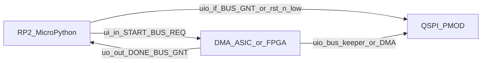

# Firmware Architecture

MicroPython firmware for the Tiny Tapeout demoboard (RP2 MCU) that programs this DMA: bus ownership, PSRAM reset + Enter/Exit Quad, QPI TCD install/dump on both devices, debug helpers, and one canned demo. Decision: **D30** (MCU data path is QPI after enter; `0xF5` exit supported; no `test/` imports; no per-ID catalog). Verbose twin: [`../../llm/12-firmware.md`](../../llm/12-firmware.md). TCD field detail: [`blocks/tcd.md`](blocks/tcd.md). Pin-level host protocol: [`blocks/host-interface.md`](blocks/host-interface.md).

## Purpose / scope

- **In scope:** demoboard MCU software for V1 bulk memcpy (dual PSRAM, 11-byte TCDs, `QUIT` end-of-chain). Lives under `firmware/` on the host / MCU filesystem; not under cocotb `test/` (D30).
- **Runtime:** MicroPython on the **TT ETR demoboard (RP2350B)** via the local [`tt-micropython-firmware/`](../../../tt-micropython-firmware/) SDK (`DemoBoard`). Upstream: TinyTapeout/tt-micropython-firmware. Dual-runtime: the same tree imports on CPython for `firmware/tests/` pytest. No `typing` runtime deps.
- **PMOD groundwork:** Tiny Tapeout QSPI PMOD guide ([PDF](../../datasheets/pdfs/Using_QSPI_TinyTapeout.pdf), [extracted notes + code catalog](../../datasheets/md/Using_QSPI_TinyTapeout.md)). 1-bit PIO SPI plus 4-bit QPI, attributed to Rohan Verma / TT guide.
- **Out of scope here:** cocotb ASIC tests, IHP PDK / LibreLane template docs as MCU APIs, TinyDMA-2C UART FPGA scripts (prior art only; do not copy), `firmware/cases.py`, a second demo script, and any import of `test/` from firmware or firmware tests.

## Platform stack

| Piece | Role |
|---|---|
| UF2 SDK image | One-time OS: hold boot, copy a TinyTapeout/tt-micropython-firmware release UF2 (MicroPython + `ttboard` + default `config.ini`) |
| `mpremote` | Copy this repo's tree (`mpremote fs cp -r firmware :/firmware`) then `mpremote reset`. There is no compile of this project's Python |
| `DemoBoard` (`tt`) | Project mux enable, `ui_in` / `uo_out` / `uio_*`, clock, `rst_n` |
| `config.ini` | Mode `ASIC_RP_CONTROL`, default project, `clock_frequency = 66e6` |
| FPGA path (M7) | Place `.bin` under `/bitstreams`; enable via `tt.shuttle` like a design; same MCU firmware drives START |

IHP clones (`ttihp-verilog-template/`, `IHP-Open-PDK/`) are not MCU architecture sources. Do not vendor the SDK into `firmware/`.

## Board / pin model

| Plane | Pins | Firmware use |
|---|---|
| Inputs (`ui_in`) | `[0]=START`, `[2]=BUS_REQ`; `[1]` and `[7:3]` unused (drive 0; D34) | Assert levels; hold START long enough for the ASIC input synchronizer |
| Outputs (`uo_out`) | `[0]=DONE`, `[1]=BUS_GNT`; `[7:2]` unused (tied 0; D34) | Poll idle and grant only |
| Bidirectional (`uio`) | QSPI PMOD: flash CS, SIO0..3, SCK, RAM A/B CS (see [`system.md`](system.md)) | Drive while `BUS_GNT=1` or `rst_n=0` (D26) |

MCU QSPI OE is **separate** from ASIC `uio_oe`. SDK `uio_oe_pico`: bits set to **1** are driven by the RP2; keep all bits **0** (Hi-Z) unless `BUS_GNT=1` or `rst_n=0`, and clear OE before dropping `BUS_REQ`.

ETR BIDIR map (`uio[0..7]` -> GPIO25..32): flash CS, MOSI, MISO, SCK, SD2, SD3, RAM A CS, RAM B CS. Full table + PIO examples: [`../../datasheets/md/Using_QSPI_TinyTapeout.md`](../../datasheets/md/Using_QSPI_TinyTapeout.md).

## Bring-up

Ordered demoboard sequence (ASIC or M7 FPGA stand-in):

1. Enable this design (`tt.shuttle.tt_um_lahnb_sgdma.enable()` or load a bitstream under `/bitstreams`).
2. Set project clock to **66 MHz** (D16) via `tt.clock_project_PWM(66e6)` or `config.ini`.
3. Deassert `rst_n`; confirm `DONE=1` and `BUS_GNT=0` (ASIC parks CS high / SCK low - D26). Unused `ui_in` bits stay 0.
4. Park MCU QSPI OE Hi-Z while `rst_n=1` and `~BUS_GNT`.
5. Grant bus, SPI reset + Enter Quad on both PSRAMs, QPI-install the `MemoryImage`, release, pulse START, wait DONE, grant, QPI-dump dest, compare `interpret_chain` `final_memory`.

REPL: `import firmware.demo as demo; demo.main()`. Or build a custom chain with `firmware.build` and `firmware.runner.run_chain`.

## System I/O and bus ownership

1. Keep the MCU QSPI pins high-Z unless `BUS_GNT` is high or `rst_n` is low (D26).
2. To access either PSRAM or flash while this design is live, assert `BUS_REQ`, wait for `BUS_GNT=1`, then enable the MCU QSPI drivers. While `rst_n=0` (including another design selected on the TT mux), MCU drive is also legal without `BUS_GNT`.
3. Before releasing the bus, finish the current transaction, drive every CE# high, make the MCU QSPI pins high-Z, then deassert `BUS_REQ`. Wait for `BUS_GNT=0` before asserting `START`.
4. Initialize both PSRAMs and leave them in QPI mode before `START`. The ASIC does not issue reset, Enter Quad, or Exit Quad commands (D17). MCU firmware still issues `0x35` / `0xF5` / `0x66` / `0x99`.
5. Assert `START` only while `DONE=1` and `BUS_REQ=0`. Hold it long enough to cross the two-flop input synchronizer, then deassert it. A START edge while busy or while `BUS_REQ=1` is ignored and not queued.
6. After pulsing `START`, do **not** assert `BUS_REQ` again until `DONE` has fallen. `DONE` falling is the firmware ACK that START was accepted.
7. `DONE=1` means the ASIC is idle. It does not grant MCU ownership of `uio`.
8. A mid-run `BUS_REQ` pauses the DMA only after its current QPI transaction. To stop a runaway chain, assert `rst_n`; V1 has no soft abort (D23).

Helpers live in `firmware/asic.py`: `enable_project`, `reset_asic` / `kill_dma`, `request_bus` / `release_bus`, `pulse_start`, `wait_busy` / `wait_done`.

### ASIC bus keeper (D26)

While `rst_n=1` and `BUS_GNT=0`, the ASIC owns the shared QSPI nets as a **bus keeper**: all CS high, SCK low, SIO don't-care in park after `tHZ` (SIO float on dummy/read and through `tHZ`). When `BUS_GNT=1` or `rst_n=0`, the ASIC releases shared OE. Full matrix: [`blocks/host-interface.md`](blocks/host-interface.md).

### Board CS pull-ups

The QSPI PMOD path has a **10 kΩ pull-up on each CS**. Backup only; do not rely on them while the ASIC is live (`rst_n=1`) and `BUS_GNT=0`. Release before seize.

## PSRAM QPI driver

Bring-up per device (under grant): CE# high `tPU` (>=150 us), SPI `0x66` then immediate `0x99`, wait `tRST`, SPI Enter Quad `0x35`. After that, MCU install/dump is **QPI** (`0xEB` read / `0x02` write). `SIO[3]` is the MSB of each nibble. Flash CS stays high. No flash QE programming (D30).

**Exit:** `exit_qpi` issues QPI `0xF5` (4-bit opcode, 2 SCK). After exit, MCU SPI is valid again; call enter before the next DMA START. Dump during a QPI session uses `0xEB` (no need to exit first).

| Opcode | Mode | Role |
|---|---|---|
| `0x66` / `0x99` | SPI | Reset Enable then Reset |
| `0x35` | SPI | Enter Quad (SPI -> QPI) |
| `0xF5` | QPI | Exit Quad (QPI -> SPI) |
| `0xEB` | QPI | Fast Read Quad (6 dummy cycles); MCU dump and ASIC fetch/read |
| `0x02` | QPI | Write; MCU install and ASIC write |

Transport (`firmware/psram.py`): ETR `PIOSPI` for 1-bit reset/enter; 4-bit PIO for QPI. Default SCK **20 MHz**. `rp2` is guarded so CPython tests inject a mock transport. SoftSPI / `machine.SPI` are not primary.

## tCEM / chunking

APS6404L needs CE# high often enough for refresh. Every MCU QPI burst must **chunk** so each CE# low pulse stays under device `tCEM` (max CE# low; default **4 us** extended grade, 25% unused margin). Raise CE# between chunks (`tCPH` min CE# high 18 ns). Never ship an unchunked multi-kilobyte dump.

| Constant | Default |
|---|---|
| `TCEM_US` | `4.0` |
| Margin | 25% of `tCEM` unused |
| SCK | 20 MHz |

QPI planner (SCK cycles): `0xEB` overhead 14 (2 cmd + 6 addr + 6 dummy); `0x02` overhead 8 (2 cmd + 6 addr); 2 SCK per payload byte. If `nbytes_max < 1`, refuse that SCK. Formula: llm twin.

Also respect firmware-facing ASIC limits: `TRANSFER_LEN` max 255; valid `ptr[22:0]` in `0x000000..0x7FFFFF` (`ptr[23]` don't-care; D35); release-before-seize.

## Writing TCDs

Copied `firmware/tcd.py` / `firmware/chain.py` are the pack/unpack/validate and `interpret_chain` contract (mechanical copy from `test/reference/`; firmware does not import `test/`). `firmware/build.py` is the thin REPL layer:

- `place_tcd` / `place_bytes` / `add_copy` / `add_quit` / `link`
- Head convention: first TCD (or quit-for-empty) at **PSRAM 0, address 0**
- Address 0 is not a terminator
- Sparse `MemoryImage`; do not allocate 8 MB

Install writes those same bytes over QPI. After DONE, dump dest extents and compare `result.final_memory`.

Serialize TCDs as 11 big-endian bytes (`SRC_PTR`, `DEST_PTR`, `TRANSFER_LEN`, `NEXT_TCD`, `CTRL_FLAGS`). Device select is in `CTRL_FLAGS`, not a pointer bit (D24). Write reserved `[3:0]` as 0. `TRANSFER_LEN=0` is a no-op that follows `NEXT_TCD`.

## Terminating a transfer chain

Every finite chain ends with a TCD whose `CTRL_FLAGS.QUIT` bit is 1. Address zero is a valid link. Empty run: place the quit TCD at the fixed head.

## PSRAM address limits

Each device is `A[22:0]` (`0x000000..0x7FFFFF`). `ptr[23]` is don't-care (D35). Validate complete spans with widened arithmetic before START (TCD fetch, and SRC/DEST when `TRANSFER_LEN > 0`). Out-of-range is undefined at runtime (D34); recover with `rst_n`.

## Safe programming sequence

1. `request_bus` (OE only in the legal window).
2. `bring_up_both` or `enter_qpi` on both devices.
3. QPI-write the `MemoryImage` (chunked).
4. Hi-Z, drop `BUS_REQ`, wait `BUS_GNT=0`.
5. `pulse_start` while `DONE=1`; do not raise `BUS_REQ` until `DONE` falls; then wait `DONE` high.
6. Grant, QPI-dump dest extents, compare. Optional `exit_qpi`.

## Debug helpers

`firmware/debug.py` (chunked QPI): dump, peek, poke, decode chain (walk `NEXT_*` until `QUIT`). Host pins stay in `asic.py`.

## Module layout

| Path | Role |
|---|---|
| `firmware/tcd.py` | Copied pack / unpack / validate |
| `firmware/chain.py` | Copied `MemoryImage`, `interpret_chain`, `ChainResult` |
| `firmware/_compat.py` | Dataclass shim if the UF2 lacks `dataclasses` |
| `firmware/build.py` | Thin helpers to assemble arbitrary chains |
| `firmware/psram.py` | Reset, enter/exit, QPI `0xEB`/`0x02`, `tCEM` chunking, PIO behind `rp2` guard |
| `firmware/asic.py` | `DemoBoard` host protocol |
| `firmware/runner.py` | Grant, install, START, wait DONE, dump, compare |
| `firmware/debug.py` | Dump / peek / poke / decode |
| `firmware/demo.py` | One pre-built PSRAM0-to-PSRAM0 copy + `QUIT` |
| `firmware/tests/` | Host pytest (D30); no `test/` imports |

No `firmware/cases.py`. No `demo_min.py`.

## Firmware logic testbench

PC **pytest** under `firmware/tests/` (D30): pack/`QUIT`/`TC_TCD_BE_BYTES`, `build.py` + `interpret_chain`, `tCEM` planner, enter/exit frames, mock `DemoBoard` START/REQ/OE, mock runner golden compare. Run `cd firmware && python -m pytest -q`. Not a substitute for Phase 3 / M7 HIL.

## Demos / M7

- **One canned demo:** `firmware/demo.py` copies a short known pattern PSRAM0 to PSRAM0, linked to `QUIT`, then prints PASS/FAIL. Everything else is built with `build.py` in the REPL.
- **M7 subset** (FPGA stand-in + real dual PSRAM; D28): same-device and cross-device copies, chaining, `QUIT`, zero-length, bus handoff, reset recovery - assembled with the tools, not a per-`TC-*` firmware catalog. M7 does not close physical `T-*` rows.

## Recovery

On DONE timeout or runaway chain: `kill_dma` (`rst_n`; D23), Hi-Z MCU, then under grant SPI reset + Enter Quad both devices before the next START. Need SPI after a QPI session: grant + `0xF5` (or `0x66`/`0x99`). No ERROR pin (D34).

## Sim relationship

Demoboard firmware is **not** [`../../../test/common/host.py`](../../../test/common/host.py). Shared intent only (grant, START, TCD rules). Do not import sim helpers from MCU code.

## Non-goals (V1 firmware)

- No `firmware/cases.py`, no one builder per `TC-*` ID, no second demo script
- No import of `test/` from firmware or firmware tests
- No ASIC flash DMA; flash is MCU pass-through under grant; no flash QE enable/disable in bring-up (D30)
- No ALU / cond-stop / ring / soft abort (kill = `rst_n`, D23)
- No copying TinyDMA-2C UART FPGA firmware (prior art only; attribute if mentioned)

**Self-pointing TCD (D35):** a descriptor may point `NEXT_TCD` at itself. Without `QUIT`, the DMA spins until `rst_n`. Prefer finite `QUIT`-terminated chains for demoboard runs.
