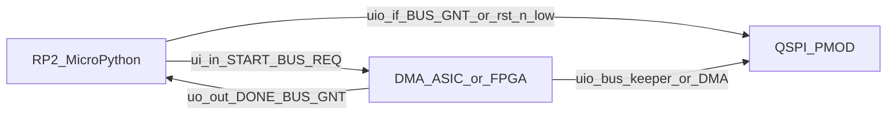

# Firmware Architecture (verbose)

Verbose twin of [`../human/architecture/firmware.md`](../human/architecture/firmware.md). Same section order. Human stays condensed but complete; this file elaborates APIs, sequences, clone paths, chunk formulas, and REPL examples. Do not treat this file as a private second source of truth: every durable requirement here appears in the human doc in some form.

Related frozen contracts: TCD format [`04-tcd-and-datapath.md`](04-tcd-and-datapath.md), QSPI/PSRAM opcodes and `tCEM` [`05-qspi-psram.md`](05-qspi-psram.md), host OE / START [`03-architecture.md`](03-architecture.md), decisions D17 / D20 / D22 / D23 / D24 / D25 / D26 / D28 / **D30**, opens Q3 / Q12 in [`08-open-questions.md`](08-open-questions.md). QSPI PMOD SPI guide: [PDF](../datasheets/pdfs/Using_QSPI_TinyTapeout.pdf), [extracted notes + code catalog](../datasheets/md/Using_QSPI_TinyTapeout.md).

## Purpose / scope

This document specifies **MicroPython demoboard firmware** for programming the scatter-gather DMA on the Tiny Tapeout **ETR** demoboard (RP2350B) with dual APS6404L-class PSRAM.

| In | Out |
|---|---|
| V1 bulk memcpy via 11-byte TCDs, dual-device, `QUIT` end-of-chain | Cocotb ASIC tests under `test/` |
| SPI bring-up, TCD install, debug helpers, demos / M7 scripts | Treating IHP PDK / LibreLane template docs as MCU APIs |
| Host-side pytest of pure firmware logic (`firmware/tests/`) | MCU-side QPI / quad I/O drivers (not required) |
| Local SDK clone [`tt-micropython-firmware/`](../../tt-micropython-firmware/); ETR QSPI PMOD `PIOSPI` catalog | Copying TinyDMA-2C UART FPGA scripts (prior art only; attribute if mentioned) |

**Boundary vs sim host:** [`test/common/host.py`](../../test/common/host.py) is the cocotb-side programming helper. It shares intent (grant, START hold, TCD rules) but is not demoboard MicroPython and must not be imported from MCU code.

**Prior art:** Per TinyDMA-2C (Andrew Kim, TT 296), UART-driven FPGA scripts exist in a separate prior-art dump. They are not this project's MCU design and must not be copied into `firmware/`.



## Platform stack

Primary clone in this repo: [`tt-micropython-firmware/`](../../tt-micropython-firmware/) (remote: TinyTapeout/tt-micropython-firmware). Supporting TT clones (`tinytapeout-sky-26c/`, `ttihp-verilog-template/`) are not MCU architecture truth.

### Install and REPL

1. Download a UF2 from the SDK releases (includes OS + `ttboard` + default `config.ini`).
2. Hold demoboard boot button, connect USB, copy UF2, wait for reboot.
3. Serial REPL on the USB CDC port (e.g. `/dev/ttyACM0` under WSL/Linux).
4. Use [`mpremote`](https://docs.micropython.org/en/latest/reference/mpremote.html) for filesystem ops:

```text
pip install --user mpremote
mpremote fs ls
mpremote fs cp firmware/tcd.py :/firmware/tcd.py
mpremote reset
```

After `mpremote` sessions the board may be suspended; `mpremote reset` reloads `config.ini` and resumes.

### DemoBoard entry

Boot path is SDK `src/main.py` → `DemoBoard.get()` (commonly bound as `tt` in the REPL). Useful attributes:

| Attribute | Use |
|---|---|
| `tt.shuttle.<design>.enable()` | Mux-select and enable this project's ASIC (or FPGA bitstream stand-in) |
| `tt.ui_in` / `tt.uo_out` | Host control / status (ASIC point of view: MCU writes inputs, reads outputs) |
| `tt.uio_in` / `tt.uio_out` / `tt.uio_oe_pico` | Shared QSPI nets and RP2 OE |
| `tt.clock_project_PWM(freq)` / config `clock_frequency` | Project `clk` (target 66 MHz, D16) |
| `tt.reset_project(True/False)` | Drive `rst_n` (active-low; SDK naming may be `nRESET`-style - confirm against `demoboard.py` when coding) |

### Modes (`config.ini`)

| Mode | Intent |
|---|---|
| `SAFE` | All RP2 pins inputs |
| `ASIC_RP_CONTROL` | MCU drives `ui_in`, clock, reset; monitors `uo_out` - **default for DMA firmware** |
| `ASIC_MANUAL_INPUTS` | Manual board switches; firmware clock/input APIs largely ignored |

Project sections may set `clock_frequency`, `rp_clock_frequency`, `ui_in`, `uio_oe_pico`, `uio_in`, and `mode`. See SDK [`config.md`](../../tt-micropython-firmware/config.md). Bidirectional pins reset to inputs when enabling another project.

### FPGA bitstream path (M7)

SDK FPGA breakout support: place suitably built `.bin` files under `/bitstreams` on the RP2 filesystem. On boot, `tt.shuttle` exposes them analogously to ASIC projects. M7 loads synthesizable RTL onto that FPGA stand-in in the ASIC's connector position with the same MCU and dual PSRAM PMOD (D28; [`verification/01-strategy.md`](verification/01-strategy.md)).

## Board / pin model

Frozen host pins (D14 / D18 / D22 / D23):

| Pad | Signal | Firmware |
|---|---|---|
| `ui_in[0]` | START | Rising edge after sync → one-`clk` pulse; hold raw level across the two-flop sync, then deassert |
| `ui_in[2]` | BUS_REQ | Level; assert before enabling MCU QSPI OE |
| `uo_out[0]` | DONE | High = ASIC idle (not a drive permit) |
| `uo_out[1]` | BUS_GNT | High = MCU may drive `uio` (also legal while `rst_n=0`; D26) |
| `ui_in[1]`, `ui_in[7:3]`, `uo_out[7:2]` | Reserved / open | Do not invent ERROR bits; Q3 packing still open |

QSPI on `uio[7:0]` matches the community flash+PSRAM PMOD map ([`../human/architecture/system.md`](../human/architecture/system.md)):

| `uio` | Net |
|---|---|
| 0 | Flash CS |
| 1 | SIO0 / MOSI |
| 2 | SIO1 / MISO |
| 3 | SCK |
| 4 | SIO2 |
| 5 | SIO3 |
| 6 | RAM A CS |
| 7 | RAM B CS |

### `uio_oe_pico` polarity

From SDK `config.md`: **`uio_oe_pico` bits set to 1 are driven by the RP2**. Bit 0 = flash CS OE, bit 3 = SCK OE, etc. Firmware must:

1. Keep `uio_oe_pico = 0` (all inputs / Hi-Z) whenever `rst_n=1` and `BUS_GNT=0`.
2. In a legal drive window (`BUS_GNT=1` or `rst_n=0`), enable only the pins needed for the current SPI phase (typically SCK + SIO0 drive for cmd/addr/write; SIO1 input for MISO; CS outputs for the selected device; float unused SIO2/3 unless a quad path needs them).
3. Clear OE **before** dropping `BUS_REQ`.

TT `uio_oe` on the ASIC side is independent. Contention = both masters enabled with disagreeing levels.

### SPI pin binding (ETR; from QSPI PMOD guide)

Authoritative demoboard SPI usage and **reusable code catalog**: [`../datasheets/md/Using_QSPI_TinyTapeout.md`](../datasheets/md/Using_QSPI_TinyTapeout.md) (transcribed from the Tiny Tapeout guide; PDF may be image-only). This project targets the **ETR** demoboard. The guide's working master is custom **PIO SPI** (`PIOSPI`); it imports `machine.SPI` but does not use HW SPI for transfers.

ETR `uio` → GPIO:

| `uio` | GPIO | Net |
|---|---|---|
| 0 | 25 | Flash CS |
| 1 | 26 | SD0 / MOSI |
| 2 | 27 | SD1 / MISO |
| 3 | 28 | SCK |
| 4 | 29 | SD2 (was WP) |
| 5 | 30 | SD3 (was HOLD) |
| 6 | 31 | RAM A CS |
| 7 | 32 | RAM B CS |

```python
QSPI_BASE = 25
PIN_FLASH_CS = QSPI_BASE + 0
PIN_MOSI     = QSPI_BASE + 1
PIN_MISO     = QSPI_BASE + 2
PIN_SCK      = QSPI_BASE + 3
PIN_SD2      = QSPI_BASE + 4
PIN_SD3      = QSPI_BASE + 5
PIN_RAM_A_CS = QSPI_BASE + 6
PIN_RAM_B_CS = QSPI_BASE + 7
```

Legacy TT04+ boards use the same logical order on GPIO21..28 (not this project's primary target). Hold all CS high when idle; only one CE# low per txn. In 1-bit mode, SD2/SD3 are inputs with pull-ups (guide flash path).

## Bring-up

Full ordered sequence for a cold demoboard session (ASIC silicon or M7 FPGA):

1. **Optional M7:** `mpremote fs cp build/design.bin :/bitstreams/tt_um_lahnb_sgdma.bin` (name as retained for the revision).
2. REPL: `tt = DemoBoard.get()` (or use the prebound `tt`).
3. `tt.shuttle.<design_or_bitstream>.enable()`.
4. Set project clock to **66e6** Hz (D16). If `config.ini` already has `clock_frequency` for this project, confirm it after enable.
5. Ensure `rst_n` is asserted briefly, then deassert. Expect `DONE=1`, `BUS_GNT=0`.
6. Confirm MCU `uio_oe_pico = 0` (park observe). ASIC is bus keeper: CS high, SCK low (D26).
7. Assert `BUS_REQ` (`ui_in[2]=1`), wait until `uo_out[1]==1`.
8. Enable SPI OE / CS drivers; run SPI init on **both** PSRAMs (next sections).
9. Install TCDs + payloads; Hi-Z; drop REQ; wait grant low; pulse START.

## Bus ownership

API-shaped restatement of the human contract (D22 / D23 / D26). Normative OE matrix: human [`blocks/host-interface.md`](../human/architecture/blocks/host-interface.md).

### Proposed helpers (`firmware/bus.py`)

```python
def request_bus(tt, timeout_ms=1000) -> None:
    """Assert BUS_REQ; wait BUS_GNT; then caller may enable SPI OE."""

def release_bus(tt) -> None:
    """Finish txn, CE# high, OE=0, drop BUS_REQ; wait BUS_GNT=0."""

def pulse_start(tt, hold_cycles_hint=4) -> None:
    """Require DONE=1 and BUS_REQ=0; assert START, hold, deassert."""

def kill_dma(tt) -> None:
    """Assert rst_n; leave MCU OE Hi-Z; caller re-QPI after deassert."""
```

### Rules (binding)

1. MCU QSPI Hi-Z unless `BUS_GNT=1` or `rst_n=0` (D26).
2. Access PSRAM/flash under grant while the design is live; while `rst_n=0` (deselected design / kill hold), MCU drive is also legal without `BUS_GNT`.
3. Before release: finish txn, CE# high, Hi-Z, drop `BUS_REQ`, wait `BUS_GNT=0` before START.
4. Both PSRAMs in QPI before START (MCU Enter Quad; ASIC emits no `0x35`/`0xF5`/`0x66`/`0x99` - D17).
5. START only while `DONE=1` and `BUS_REQ=0`; hold across sync; busy/`BUS_REQ` edges ignored and not queued.
6. `DONE` ≠ drive permit.
7. Mid-run `BUS_REQ` pauses after current QPI txn; runaway kill = `rst_n` only (no soft abort).

Board **10 kΩ** CS pull-ups cover reset / pre-enable when MCU is not driving CS; do not rely on them alone while the design is live (`rst_n=1`) and `~BUS_GNT`.

## SPI PSRAM driver

### Transport policy (D30; ETR QSPI PMOD guide)

| Preference | Detail |
|---|---|
| Primary | **PIO SPI** (`PIOSPI` / `spi_cpha0`) from the ETR appendix script |
| Rates in guide | Ctor default 1 MHz; flash/PSRAM helpers **10 MHz** |
| CS | Separate GPIO per device; all high when idle; never two CE# low |
| Data width | Basic SPI only (1-bit cmd/addr/data) for V1 firmware |
| Not required | MCU QPI, MCU flash quad path, `0xEB` from the MCU |
| Not primary | SoftSPI or HW `machine.SPI` (guide does not use them as master) |
| Groundwork | Reuse catalogued patterns in [`Using_QSPI_TinyTapeout.md`](../datasheets/md/Using_QSPI_TinyTapeout.md) (`PIOSPI`, `spi_cmd` / `spi_cmd2`, PSRAM `0x02`/`0x03`, flash SR/QE helpers) |

ETR scripts also call `machine.freq(150_000_000)` so PIO dividers are deterministic. Optional guide flag `DISABLE_TT_ASIC` selects chip ROM so bidirs are inputs for MCU SPI when no design is driving - consistent with D26 MCU-safe drive while `rst_n=0`.

**Guide vs project APS6404L mode:** guide `test_psram` stays in SPI (`0x02`/`0x03` only). Project firmware must still run `0x66`/`0x99` then `0x35` before START (D17). The guide's flash `qspi_read` PIO is a **reference only** for MCU flash quad tooling; do not confuse it with PSRAM Enter Quad.

### Reference snippets (adapt into `firmware/psram_spi.py`)

Full copies live in the datasheet markdown catalog. Minimal wiring:

```python
# After pins defined as above:
spi = PIOSPI(1, Pin(PIN_MOSI), Pin(PIN_MISO), Pin(PIN_SCK), freq=10_000_000)
flash_sel = Pin(PIN_FLASH_CS, Pin.OUT); flash_sel.on()
ram_a_sel = Pin(PIN_RAM_A_CS, Pin.OUT); ram_a_sel.on()
ram_b_sel = Pin(PIN_RAM_B_CS, Pin.OUT); ram_b_sel.on()

# PSRAM write / read (guide pattern; add tCEM chunking for long payloads)
spi_cmd2([0x02, addr >> 16, (addr >> 8) & 0xFF, addr & 0xFF], data, ram_a_sel)
rdata = spi_cmd([0x03, addr >> 16, (addr >> 8) & 0xFF, addr & 0xFF], ram_a_sel, 0, len(data))
```

### MCU opcode set (under grant)

| Opcode | Bytes | Notes |
|---|---|---|
| `0x03` | cmd + 3-addr + data-out | SPI read; max 33 MHz class |
| `0x02` | cmd + 3-addr + data-in | SPI write |
| `0x66` | cmd | Reset Enable; must be followed immediately by `0x99` |
| `0x99` | cmd | Reset; wait `tRST` (≥50 ns) then next cmd |
| `0x35` | cmd | Enter Quad; SPI → QPI |
| `0xF5` | cmd | Exit Quad; **QPI-only** - after DONE if SPI needed; or use reset to return to SPI |
| `0x9F` | cmd + addr + EID | Read ID; SPI diagnostics |

ASIC DMA uses QPI `0xEB` / `0x02` only (D15/D17). MCU never needs to emit `0xEB` for V1 firmware correctness.

### Per-device bring-up sequence

For each of PSRAM A and PSRAM B:

1. CE# high ≥ `tPU` (150 us) after power / long reset.
2. Under grant: `0x66` then immediately `0x99` on that CS.
3. Wait `tRST`.
4. Issue `0x35` (Enter Quad).
5. Leave CE# high. Device is now QPI; further MCU SPI opcodes are invalid until Exit Quad or reset.

### Proposed helpers (`firmware/psram_spi.py`)

```python
def spi_reset(spi, cs) -> None: ...
def enter_qpi(spi, cs) -> None: ...
def exit_qpi_via_reset(spi, cs) -> None:  # 0x66/0x99 returns SPI standby
def spi_read(spi, cs, addr: int, n: int) -> bytes: ...
def spi_write(spi, cs, addr: int, data: bytes) -> None: ...
def read_id(spi, cs) -> bytes: ...
```

All transfers go through the chunker (next section). Flash CS may use the same SPI bus under grant for MCU-only flash access; ASIC never selects flash.

### REPL sketch

```python
>>> request_bus(tt)
>>> enable_spi_oe(tt)
>>> for cs in (cs_a, cs_b):
...     spi_reset(spi, cs); enter_qpi(spi, cs)
>>> # ... install TCDs ...
>>> release_bus(tt)
>>> pulse_start(tt)
>>> while not int(tt.uo_out[0]): pass
>>> request_bus(tt); enable_spi_oe(tt)
>>> print(spi_read(spi, cs_a, 0x100000, 16).hex())
```

## tCEM / chunking

### Why firmware must chunk

Device physics (APS6404L Table 10 class; [`05-qspi-psram.md`](05-qspi-psram.md) only - MCU chunk policy is not an ASIC D20 rule):

| Symbol | Binding for MCU SPI planning |
|---|---|
| `tCEM` | Max CE# low: **4 us** extended-grade default (8 us standard grade) |
| `tCPH` | Min CE# high between bursts: 18 ns (trivial at MCU SPI rates) |
| `tPU` / `tRST` | 150 us / 50 ns |

ASIC V1 `N=1` keeps DMA CE# pulses short (D20 contrast only). **MCU SPI** can still hold CE# across a long `0x03`/`0x02` burst, so firmware must slice payloads.

### Chunk-size formula

For SPI read `0x03` / write `0x02` with 8-bit cmd + 24-bit addr + `nbytes` data, one CE# pulse clocks approximately:

```text
bits ≈ 8 + 24 + 8 * nbytes
t_CE_low ≈ bits / f_SCK
```

Require `t_CE_low < tCEM` with margin. Solving for payload bytes:

```text
nbytes_max = floor( (tCEM * f_SCK - 32) / 8 ) - margin_bytes
```

Example at **f_SCK = 1 MHz**, `tCEM = 4e-6`:

```text
bits_budget ≈ 4  (too few at 1 MHz - 4 us * 1e6 = 4 bit times)
```

So at 1 MHz SPI, even cmd+addr alone is tight relative to 4 us; use a slower effective transaction style (raise CE# between tiny payloads) or raise SCK. At **f_SCK = 8 MHz**:

```text
bits_budget = 4e-6 * 8e6 = 32 bits → nbytes_max ≈ 0 after cmd+addr
```

Still tight. At **f_SCK = 20 MHz**:

```text
bits_budget = 80 bits → nbytes_max ≈ (80 - 32) / 8 = 6 bytes before margin
```

**Note on the PMOD guide:** helpers often transfer **8 bytes at 10 MHz** (`bits ≈ 32 + 64 = 96` → ~9.6 us CE# low), which can exceed extended-grade `tCEM` (4 us). Treat the guide as a **functional pin/SPI pattern**, not a refresh-safe burst length. Project firmware must still chunk.

Practical demoboard bring-up default (conservative; also in human `firmware.md`):

| Constant | Value | Rationale |
|---|---|---|
| `TCEM_US` | `4.0` | Extended-grade default from device / `05-qspi-psram.md` |
| `SPI_CHUNK_BYTES` | `1` | Safe default until recomputed at the chosen PIO SPI rate (guide helpers use 10 MHz) |
| Margin | Leave ≥25% of `tCEM` unused | Board / PIO jitter |

**Implementation rule:** `spi_read` / `spi_write` loop in chunks of `SPI_CHUNK_BYTES`, raising CE# between chunks (≥ `tCPH`). Never single-CE# a multi-kilobyte dump.

Also enforce ASIC firmware-facing limits when building TCDs: `TRANSFER_LEN ≤ 255`, addresses in `0x000000..0x7FFFFF`, release-before-seize.

## TCD install

### Serialization (D25 / D24)

11-byte big-endian layout (same as human doc):

| Offset | Field |
|---|---|
| 0..2 | `SRC_PTR` MSB-first |
| 3..5 | `DEST_PTR` |
| 6 | `TRANSFER_LEN` |
| 7..9 | `NEXT_TCD` |
| 10 | `CTRL_FLAGS`: bit0 `QUIT`, bit1 `SRC_DEVICE`, bit2 `DEST_DEVICE`, bit3 `NEXT_DEVICE`, bits 7:4 = 0 |

```python
def pack_tcd(src, dest, length, nxt, flags) -> bytes:
    def be24(x):
        return bytes([(x >> 16) & 0xFF, (x >> 8) & 0xFF, x & 0xFF])
    return be24(src) + be24(dest) + bytes([length & 0xFF]) + be24(nxt) + bytes([flags & 0xFF])
```

Validate with widened integers before write (human address-limits section).

### Install sequence under grant

1. `request_bus` + SPI OE.
2. If devices are in QPI from a prior run and SPI is needed: Exit Quad (`0xF5` in QPI) or `0x66`/`0x99` reset, then continue in SPI. For a clean cold start, reset + Enter Quad at the end of programming so ASIC sees QPI.
3. Practical cold program path:
   - Reset both devices (SPI).
   - SPI-write TCD bytes and payloads to **both** PSRAMs as required (chunked).
   - Head TCD at `0x000000` on **PSRAM 0**.
   - Enter Quad on both devices.
4. `release_bus`; `pulse_start`.

Suggested software regions (convention only): [`../human/architecture/system.md`](../human/architecture/system.md) logical memory map - head at 0/PSRAM0, TCDs low, sources mid, dests high.

### Staging helper sketch

```python
def install_chain(spi, cs_a, cs_b, nodes: list[TcdNode]) -> None:
    """Write each node's 11 bytes to its (device, addr); ensure head is PSRAM0:0."""
```

## Debug helpers

Proposed signatures (`firmware/debug.py` + bus helpers):

```python
def dump(spi, cs, addr: int, length: int, width: int = 16) -> None:
    """Print hex lines; uses chunked spi_read."""

def peek(spi, cs, addr: int, n: int = 1) -> bytes: ...
def poke(spi, cs, addr: int, data: bytes) -> None: ...

def decode_chain(spi, cs_a, cs_b, head_addr: int = 0, head_dev: int = 0, max_nodes: int = 64) -> None:
    """Fetch 11-byte records following NEXT_*; stop on QUIT or max_nodes."""

def poll_done(tt) -> bool: ...
def poll_gnt(tt) -> bool: ...
```

REPL example after a completed copy:

```python
>>> request_bus(tt); enable_spi_oe(tt)
>>> # devices may still be in QPI - reset to SPI for dump
>>> for cs in (cs_a, cs_b):
...     spi_reset(spi, cs)
>>> dump(spi, cs_b, 0x200000, 32)
>>> decode_chain(spi, cs_a, cs_b)
>>> for cs in (cs_a, cs_b):
...     enter_qpi(spi, cs)  # restore before next START
>>> release_bus(tt)
```

## Module layout (proposed)

| Path | Role | Depends on `ttboard`? |
|---|---|---|
| `firmware/bus.py` | REQ/GNT, OE, START, `rst_n` | Yes at runtime |
| `firmware/psram_spi.py` | ETR `PIOSPI` (from QSPI guide catalog), opcodes, `tCEM` chunking | Optional (`rp2` on MCU; mockable) |
| `firmware/tcd.py` | Pack / unpack / validate / `QUIT` chains | No (pure) |
| `firmware/debug.py` | Dump / decode | Uses psram_spi |
| `firmware/demo_min.py` | Minimum happy-path demo | Yes |
| `firmware/demo_m7_*.py` | M7 regression scripts | Yes |
| `firmware/tests/test_tcd.py` etc. | PC pytest | No hardware |

Package layout is documentation of intent until the firmware workstream creates the Python tree. Prefer keeping `tcd.py` and chunk math importable on CPython without `ttboard`.

## Firmware logic testbench

Host-side **pytest** under `firmware/tests/` (required by D30; may start before demoboard bring-up):

| Covered | Not covered |
|---|---|
| Big-endian pack / unpack | Real `DemoBoard` SPI |
| `QUIT` / device-flag validation | Timing vs APS6404L silicon |
| Address-range checks (no wrap) | M7 HIL |
| SPI frame byte builders (`0x03`/`0x02`/…) | Contended bus |
| `tCEM` chunk planner vs `f_SCK` | FPGA bitstream load |
| Dump/format helpers | |

Run sketch (once implemented):

```text
cd firmware && pytest -q
```

This suite catches serialization and chunking bugs early. It does **not** replace M7 (D28) or cocotb `test/`.

## Demos / M7

**Process sequencing:** after the cocotb/RTL verification milestones that gate M7 entry are complete, FPGA testing must be ready to run. Demoboard/FPGA bring-up (including this firmware library) is therefore allowed and needed before or as M7 starts - not deferred until after M7. Host-side `firmware/tests` unit logic can start earlier; demoboard HIL remains Phase 3 / M7.

### Minimum demo

1. Enable design @ 66 MHz; release reset; observe DONE.
2. Grant → SPI reset + program a one-TCD copy + `QUIT` on PSRAM0 (payload on A or B as chosen) → Enter Quad both.
3. Release → START → wait DONE (timeout → recovery).
4. Grant → SPI reset → dump destination → compare.

### M7 high-value subset

From verification strategy / D28 / D30, driven by real MCU firmware (not cocotb):

- Same-device copies (A→A, B→B)
- Cross-device A→B and B→A
- Multi-TCD chaining
- `QUIT` terminator / empty run (`QUIT` at head)
- Zero-length data TCD (no-op then next)
- Bus handoff (`BUS_REQ` mid-run pause / resume)
- Reset recovery (`rst_n` kill + re-QPI + rerun)

Retain scripts and vectors with the RTL revision they validated. M7 does not close IHP pad `T-*` rows.

Vector reuse: cocotb reference-model chain intent may be frozen as fixed byte patterns for firmware tests; keep generators or fixtures under `firmware/` (or shared pure modules), not under `test/` as a hard dependency for MCU deploy.

## Recovery

| Symptom | Action |
|---|---|
| DONE never returns | `kill_dma` / `rst_n`; Hi-Z MCU; after deassert, grant → SPI reset + Enter Quad both → reinstall or retry |
| Need SPI after QPI run | Grant → `0xF5` (if still QPI) or `0x66`/`0x99` |
| Suspected OOR / bad chain | Treat as undefined today (Q12); prefer validate-before-START; sticky ERROR on `uo_out[7:2]` not frozen (Q3) |

Do not invent status bits. START hold: long enough for two-flop sync at 66 MHz (human host-interface: prefer multi-cycle assert then deassert before a later edge).

## Sim relationship

| Tree | Role |
|---|---|
| `firmware/` (proposed) | Demoboard MicroPython + PC unit tests |
| `test/common/host.py` | Cocotb stimulus helpers |
| `test/tests/` | ASIC / engine sim regression |

Shared **intent** only: grant before drive, big-endian TCD, fixed head, `QUIT`, `rst_n` kill. Separate implementations; no requirement that APIs match 1:1.

## Non-goals (V1 firmware)

- MCU QPI / quad I/O not required (basic SPI only)
- No ASIC flash DMA; flash is MCU pass-through under grant (D11/D26)
- No ALU / cond-stop / ring / soft abort (post-V1: [`10-post-v1-features.md`](10-post-v1-features.md); kill = `rst_n`, D23)
- No copying TinyDMA-2C prior-art firmware
- No llm-only requirements: if a durable rule is needed, it must also appear in [`../human/architecture/firmware.md`](../human/architecture/firmware.md)

## See also

- Human twin: [`../human/architecture/firmware.md`](../human/architecture/firmware.md)
- System / MCU setup: [`../human/architecture/system.md`](../human/architecture/system.md)
- Host interface: [`../human/architecture/blocks/host-interface.md`](../human/architecture/blocks/host-interface.md)
- PSRAM opcodes / `tCEM`: [`05-qspi-psram.md`](05-qspi-psram.md)
- Decision log: D17, D20, D22-D26, D28, D30
- Opens: Q3, Q12 in [`08-open-questions.md`](08-open-questions.md)
- M7: [`verification/01-strategy.md`](verification/01-strategy.md)
- QSPI PMOD SPI guide: [PDF](../datasheets/pdfs/Using_QSPI_TinyTapeout.pdf), [ETR notes + code catalog](../datasheets/md/Using_QSPI_TinyTapeout.md)
- SDK: [`../../tt-micropython-firmware/README.md`](../../tt-micropython-firmware/README.md), [`config.md`](../../tt-micropython-firmware/config.md)
