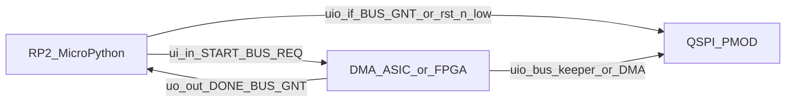

# Firmware Architecture (verbose)

Verbose twin of [`../human/architecture/firmware.md`](../human/architecture/firmware.md). Same section order. Human stays condensed but complete; this file elaborates APIs, sequences, clone paths, chunk formulas, and REPL examples. Do not treat this file as a private second source of truth: every durable requirement here appears in the human doc in some form.

Related frozen contracts: TCD format [`04-tcd-and-datapath.md`](04-tcd-and-datapath.md), QSPI/PSRAM opcodes and `tCEM` [`05-qspi-psram.md`](05-qspi-psram.md), host OE / START [`03-architecture.md`](03-architecture.md), decisions D17 / D20 / D22 / D23 / D24 / D25 / D26 / D28 / D30 / **D37** / D34. QSPI PMOD SPI guide: [PDF](../datasheets/pdfs/Using_QSPI_TinyTapeout.pdf), [extracted notes + code catalog](../datasheets/md/Using_QSPI_TinyTapeout.md).

## Purpose / scope

This document specifies **MicroPython demoboard firmware** for programming **TinyDMA** on the Tiny Tapeout **ETR** demoboard (RP2350B) with dual APS6404L-class PSRAM.

| In | Out |
|---|---|
| V1 bulk memcpy via 11-byte TCDs, dual-device, `QUIT` end-of-chain | Cocotb ASIC tests under `test/` |
| SPI bring-up, QPI install/dump after Enter Quad, Exit Quad `0xF5`, debug helpers | Treating IHP PDK / LibreLane template docs as MCU APIs |
| Host-side pytest of pure firmware logic (`firmware/tests/`) | Chain building, golden oracle, or per-`TC-*` catalogs under `firmware/` |
| Host-side HIL regression (`hil/`; D37) with directed `TC-*` and random campaigns | Any `from test...` / `import test` under `firmware/` including tests |
| Local SDK clone [`tt-micropython-firmware/`](../../tt-micropython-firmware/); ETR QSPI PMOD `PIOSPI` + 4-bit QPI catalog | Copying TinyDMA-2C UART FPGA scripts (prior art only; attribute if mentioned) |
| Copied `firmware/tcd.py` only (pack/unpack/validate) | Deleted MCU copies of `chain.py`, `runner.py`, `build.py`, `demo.py`, `asic.py` |

**Boundary vs sim host:** [`test/common/host.py`](../../test/common/host.py) is the cocotb-side programming helper. It shares intent (grant, START hold, TCD rules) but is not demoboard MicroPython and must not be imported from MCU code.

**Prior art:** Per TinyDMA-2C (Andrew Kim, TT 296), UART-driven FPGA scripts exist in a separate prior-art dump. They are not this project's MCU design and must not be copied into `firmware/`.



## Platform stack

Primary clone in this repo: [`tt-micropython-firmware/`](../../tt-micropython-firmware/) (remote: TinyTapeout/tt-micropython-firmware; gitignored supporting clone). Do not vendor SDK sources into `firmware/`. Supporting TT clones (`tinytapeout-sky-26c/`, `ttihp-verilog-template/`) are not MCU architecture truth.

### Install and REPL

There is **no compile** of this project's Python. The RP2 already runs MicroPython from a UF2. Project firmware is copied onto the MCU filesystem and imported.

1. One-time OS: hold demoboard boot, copy a SDK **UF2** from TinyTapeout/tt-micropython-firmware releases (includes MicroPython + `ttboard` + default `config.ini`).
2. Serial REPL on the USB CDC port (`/dev/ttyACM0` under WSL).
3. Copy this repo's tree:

```text
pip install --user mpremote
mpremote fs cp -r firmware :/firmware
mpremote reset
```

4. REPL: enable the design (`tt.shuttle.tt_um_lahnb_sgdma.enable()` or load an M7 `.bin` under `/bitstreams`), then `import firmware.session as session; session.init()` for a persistent bring-up session, or use `firmware.debug` peek/poke helpers after grant.
5. Optional `config.ini`: `mode = ASIC_RP_CONTROL`, `clock_frequency = 66e6`, default project. After `config.ini` edits, `mpremote reset`.

After `mpremote` sessions the board may be suspended; `mpremote reset` reloads `config.ini` and resumes.

### DemoBoard entry

Boot path is SDK `src/main.py` -> `DemoBoard.get()` (commonly bound as `tt` in the REPL). Useful attributes:

| Attribute | Use |
|---|---|
| `tt.shuttle.<design>.enable()` | Mux-select and enable this project's ASIC (or FPGA bitstream stand-in) |
| `tt.ui_in` / `tt.uo_out` | Host control / status (ASIC point of view: MCU writes inputs, reads outputs) |
| `tt.uio_in` / `tt.uio_out` / `tt.uio_oe_pico` | Shared QSPI nets and RP2 OE |
| `tt.clock_project_PWM(freq)` / config `clock_frequency` | Project `clk` (target 66 MHz, D16) |
| `tt.reset_project(True/False)` | Drive `rst_n` (active-low; SDK naming may be `nRESET`-style - confirm against `demoboard.py` when coding) |

`firmware/board/board.py` `Board.enable_project` holds `ui_in=0`, asserts `rst_n`, mux-selects `tt_um_lahnb_sgdma` (or an M7 bitstream name), clocks **66 MHz**, deasserts `rst_n`, and samples `DONE=1` / `BUS_GNT=0`. Mode `ASIC_RP_CONTROL` is the expected `config.ini` setting. `DmaController.rst_n_low` uses Board-recorded `reset_project` state, not a DemoBoard `_in_reset` attribute.

### Modes (`config.ini`)

| Mode | Intent |
|---|---|
| `SAFE` | All RP2 pins inputs |
| `ASIC_RP_CONTROL` | MCU drives `ui_in`, clock, reset; monitors `uo_out` - required by TinyDMA firmware. FPGA auto-detection starts in manual-input mode, then `Board.enable_design` selects this mode before programming the design |
| `ASIC_MANUAL_INPUTS` | Manual board switches; firmware clock/input APIs largely ignored |

Project sections may set `clock_frequency`, `rp_clock_frequency`, `ui_in`, `uio_oe_pico`, `uio_in`, and `mode`. See SDK [`config.md`](../../tt-micropython-firmware/config.md). Bidirectional pins reset to inputs when enabling another project.

### FPGA bitstream path (M7)

SDK FPGA breakout support: place suitably built `.bin` files under `/bitstreams` on the RP2 filesystem. On boot, `tt.shuttle` exposes them analogously to ASIC projects. M7 loads synthesizable RTL onto that FPGA stand-in in the ASIC's connector position with the same MCU and dual-PSRAM PMOD (D28; [`verification/01-strategy.md`](verification/01-strategy.md)).

Build and upload through the testbench wrapper (walkthrough: [`../human/verification/fpga.md`](../human/verification/fpga.md)):

```text
source test/env.sh
python -m hil bitstream
python -m hil upload --port /dev/ttyACM0
```

Manual equivalent: `mpremote fs cp hil/fpga/build/tt_um_lahnb_sgdma.bin :/bitstreams/tt_um_lahnb_sgdma.bin`.

Then enable it like a shuttle project. Same MCU firmware drives START against FPGA or ASIC. HIL: `pytest hil/tests/ --target=fpga`, which compiles and uploads before the first test. Bitstream verbs are a subset of `python -m hil` (not `test/Makefile`, not GitHub Actions).

`mpremote reset` after that copy drops USB CDC. The COM / ttyACM name usually stays the same, but the host must wait until `mpremote` can open it again (`wait_for_mpremote_port`, default 20 s) before `session.init`. Connecting immediately is `failed to access COM10 (it may be in use by another program)`, not a second process holding the port. `SerialTransport` retries that same access error on later calls.

## Board / pin model

Frozen host pins (D14 / D18 / D22 / D23):

| Pad | Signal | Firmware |
|---|---|---|
| `ui_in[0]` | START | Rising edge after sync -> one-`clk` pulse; GPIO writes cover the two-flop hold |
| `ui_in[2]` | BUS_REQ | Level; assert before enabling MCU QSPI OE |
| `uo_out[0]` | DONE | High = ASIC idle (not a drive permit) |
| `uo_out[1]` | BUS_GNT | High = MCU may drive `uio` (also legal while `rst_n=0`; D26) |
| `ui_in[1]`, `ui_in[7:3]`, `uo_out[7:2]` | Unused (tied 0; D34) | Drive unused inputs low; ignore reads of `[7:2]` |

QSPI on `uio[7:0]` matches the community flash+PSRAM PMOD map ([`../human/architecture/system.md`](../human/architecture/system.md)):

| `uio` | Net |
|---|---|
| 0 | Flash CS |
| 1 | SIO0 / MOSI |
| 2 | SIO1 / MISO |
| 3 | SCK |
| 4 | SIO2 |
| 5 | SIO3 |
| 6 | RAM A CS |
| 7 | RAM B CS |

### `uio_oe_pico` polarity

From SDK `config.md`: **`uio_oe_pico` bits set to 1 are driven by the RP2**. Bit 0 = flash CS OE, bit 3 = SCK OE, etc. Firmware must:

1. Keep `uio_oe_pico = 0` (all inputs / Hi-Z) whenever `rst_n=1` and `BUS_GNT=0`.
2. In a legal drive window (`BUS_GNT=1` or `rst_n=0`), enable the pins needed for the current SPI/QPI phase.
3. Clear OE **before** dropping `BUS_REQ`.

TT `uio_oe` on the ASIC side is independent. Contention = both masters enabled with disagreeing levels.

### SPI pin binding (ETR; from QSPI PMOD guide)

Authoritative demoboard SPI usage and **reusable code catalog**: [`../datasheets/md/Using_QSPI_TinyTapeout.md`](../datasheets/md/Using_QSPI_TinyTapeout.md) (transcribed from the Tiny Tapeout guide; PDF may be image-only). This project targets the **ETR** demoboard. The guide's working 1-bit master is custom **PIO SPI** (`PIOSPI`); it imports `machine.SPI` but does not use HW SPI for transfers. Project firmware adapts that plus four-wire QPI PIO (guide `qspi_read` as starting point). Attribution: **Rohan Verma** (github.com/rohanverm94) ETR appendix.

ETR `uio` -> GPIO:

| `uio` | GPIO | Net |
|---|---|---|
| 0 | 25 | Flash CS |
| 1 | 26 | SD0 / MOSI |
| 2 | 27 | SD1 / MISO |
| 3 | 28 | SCK |
| 4 | 29 | SD2 (was WP) |
| 5 | 30 | SD3 (was HOLD) |
| 6 | 31 | RAM A CS |
| 7 | 32 | RAM B CS |

```python
QSPI_BASE = 25
PIN_FLASH_CS = QSPI_BASE + 0
PIN_MOSI     = QSPI_BASE + 1
PIN_MISO     = QSPI_BASE + 2
PIN_SCK      = QSPI_BASE + 3
PIN_SD2      = QSPI_BASE + 4
PIN_SD3      = QSPI_BASE + 5
PIN_RAM_A_CS = QSPI_BASE + 6
PIN_RAM_B_CS = QSPI_BASE + 7
```

Legacy TT04+ boards use the same logical order on GPIO21..28 (not this project's primary target). Hold all CS high when idle; only one CE# low per txn. Flash CS stays high during PSRAM traffic.

## Bring-up

Full ordered sequence for a cold demoboard session (ASIC silicon or M7 FPGA):

1. **Optional M7:** `mpremote fs cp build/design.bin :/bitstreams/tt_um_lahnb_sgdma.bin`.
2. REPL: `tt = DemoBoard.get()` (or use the prebound `tt`).
3. `import firmware.session as session; session.init()` (or construct `Board` / `DmaController` / `Psram` manually).
4. `session.enable_project()` (`ui_in=0`, reset assert, mux, 66 MHz, reset deassert, `DONE=1` / `GNT=0`).
5. Confirm `DONE=1` and `BUS_GNT=0` after that sequence.
6. Confirm MCU `uio_oe_pico = 0`. ASIC is bus keeper: CS high, SCK low (D26).
7. `session.bring_up_psram()`: `tPU`, SPI `0x66`/`0x99`, Enter Quad `0x35` on both devices under grant, then `release_bus`. START is refused while `BUS_GNT` is high. The software `in_qpi` flag is not a device status read.
8. Host HIL (or manual REPL) QPI-writes the `MemoryImage` built on the PC; peek the head TCD; Hi-Z; drop REQ; wait grant low; `session.start_and_wait()` (or `pulse_start` + `wait_idle_after_start`). Devices stay in QPI across the handoff (D17: the ASIC never issues `0x35` / `0xF5`).
9. Grant; QPI-dump dest extents via `session.read_spans` or `debug.dump`; compare against `interpret_chain` on the host. Optional `exit_qpi`. The HIL `session` fixture calls `shutdown()` with `exit_qpi=False`: MCU Hi-Z and `ui_in=0` only. It does **not** Exit Quad `0xF5` or SPI-reset the chips. A kill (`rst_n`) also does not reset the PSRAMs. The next test's `bring_up_psram()` then sends SPI `0x66` unless `in_qpi` is still True (it is cleared by `init` / `shutdown`), which is illegal if the devices never left QPI.

For automated regression, prefer host pytest under `hil/` (`python -m hil --target=...` or `pytest hil/tests/ --target=...`) instead of hand-rolling install/compare on the MCU.

## Bus ownership

API-shaped restatement of the human contract (D22 / D23 / D26). Normative OE matrix: human [`blocks/host-interface.md`](../human/architecture/blocks/host-interface.md). Implemented in `firmware/dma.py` (`DmaController`) on top of `firmware/board/board.py` (`Board`).

```python
def request_bus(self, timeout_ms=1000, oe=OE_QPI) -> None:
    """Assert BUS_REQ; wait BUS_GNT; then enable MCU QSPI OE if requested.

    Use ``OE_QPI`` for command/addr/write, ``OE_QPI_READ`` to float SIO during
    QPI dummy/data, ``OE_SPI`` for 1-bit bring-up (HOLD#/WP# as inputs).
    """

def release_bus(self) -> None:
    """Hi-Z first, drop BUS_REQ, wait BUS_GNT=0."""

def pulse_start(self, hold_us=0) -> None:
    """Require DONE=1 and BUS_REQ=0. Optional hold is not the capture mechanism."""

def wait_idle_after_start(self, timeout_ms=5000) -> None:
    """If DONE is observed low, wait until high. If never low, already idle."""

def reset_dma(self) -> None:
    """Assert rst_n; clear ui_in (BUS_REQ/START=0); leave MCU OE Hi-Z."""
```

### Rules (binding)

1. MCU QSPI Hi-Z unless `BUS_GNT=1` or `rst_n=0` (D26).
2. Access PSRAM/flash under grant while the design is live; while `rst_n=0` (deselected design / kill hold), MCU drive is also legal without `BUS_GNT`.
3. Before release: finish txn, CE# high, Hi-Z, drop `BUS_REQ`, wait `BUS_GNT=0` before START.
4. Both PSRAMs in QPI before START (MCU Enter Quad; ASIC emits no `0x35`/`0xF5`/`0x66`/`0x99` - D17).
5. START only while `DONE=1` and `BUS_REQ=0`. Hold START **low across `rst_n` kill / reset release**; assert only after DONE high and `~BUS_REQ`. GPIO writes cover the two-flop sync; do not use a 1 us sleep as capture. A START edge while busy or while `BUS_REQ=1` is **ignored and not queued**.
6. After pulsing START, `wait_idle_after_start` before `BUS_REQ`. Observed `DONE` low is the START-accept ACK; then wait until `DONE` high. If `DONE` is never observed low, treat as fast completion (already idle), not `reset_dma`. Overlapping `BUS_REQ` with the START pulse before the ASIC leaves IDLE can discard START (IDLE priority) or accept START and stall at `NEW_FETCH`.
7. `DONE` is not a drive permit.
8. Mid-run `BUS_REQ` pauses after the current QPI txn; runaway kill = `rst_n` only (no soft abort).

Board **10 kΩ** CS pull-ups cover reset / pre-enable when MCU is not driving CS; do not rely on them alone while the design is live (`rst_n=1`) and `~BUS_GNT`.

Timeouts in `wait_done` / `request_bus` / `release_bus` call `reset_dma` (also zeros `ui_in` so `BUS_REQ` cannot stick at 1). A missed `DONE` low after START does not.

## PSRAM QPI driver

### Transport policy (D30; ETR QSPI PMOD guide)

| Preference | Detail |
|---|---|
| SPI bring-up | 1-bit **PIO SPI** (`PIOSPI` / `spi_cpha0`) from the ETR appendix (Rohan Verma) |
| QPI install/dump | One PIO SM per direction. It shifts the contiguous GPIO26..30 range (SIO0, SIO1, SCK, SIO2, SIO3) as two five-bit symbols per QPI byte: side-set controls the SCK slot and firmware packs/unpacks the four SIO bits. Write SM uses `fifo_join=JOIN_TX` (8-word TX) so a 5-byte `0x02`+addr+1 payload frame can be prefilled while the SM is idle |
| Default SCK | **20 MHz** (planner refuses a rate that cannot fit one payload byte under `tCEM`) |
| CS | Separate GPIO per device; all high when idle; never two CE# low; flash CS stays high |
| Not primary | SoftSPI or HW `machine.SPI` |
| CPython | `rp2` imported behind a guard; tests inject a mock transport |
| Flash QE | **Not required.** First-party PMOD ships with flash Quad Enable set (D30) |

ETR scripts also call `machine.freq(150_000_000)` so PIO dividers are deterministic. Optional; the library does not force it (USB CDC can be sensitive). Optional guide flag `DISABLE_TT_ASIC` selects chip ROM so bidirs are inputs for MCU SPI when no design is driving - consistent with D26 MCU-safe drive while `rst_n=0`.

**Guide vs project device modes:**

- **Flash QE:** shipping first-party hardware already has Quad SPI enabled; no firmware/ASIC intervention to enable or disable flash QSPI mode (D30).
- **APS6404L:** guide `test_psram` stays in SPI (`0x02`/`0x03` only). Project firmware must still run `0x66`/`0x99` then `0x35` before START (D17), then switches the MCU master to QPI for install/dump.
- Guide flash `qspi_read` PIO is the **starting point** for MCU PSRAM QPI, not a flash-QE tool.

### MCU opcode set

| Opcode | Bus | Notes |
|---|---|---|
| `0x66` | SPI | Reset Enable; must be followed immediately by `0x99` |
| `0x99` | SPI | Reset; wait `tRST` (>=50 ns) then next cmd |
| `0x35` | SPI | Enter Quad; SPI -> QPI |
| `0xF5` | QPI | Exit Quad; 4-bit opcode, 2 SCK |
| `0xEB` | QPI | Fast Read Quad; 24-bit addr; 6 dummy cycles; MCU dump |
| `0x02` | QPI | Write; 24-bit addr; MCU install |

ASIC DMA uses QPI `0xEB` / `0x02` only (D15/D17). MCU uses the same data opcodes after enter.

### Per-device bring-up sequence

For each of PSRAM A (device 0) and PSRAM B (device 1):

1. CE# high >= `tPU` (150 us) after power / long reset. Firmware uses an elapsed-time wait so a short `sleep_us` cannot under-wait.
2. Under grant: `0x66` then immediately `0x99` on that CS.
3. Next command is `0x35` (Enter Quad). Python/GPIO between `0x99` and `0x35` covers `tRST` (min 50 ns); do not insert a 1 us sleep as that wait.
4. Leave CE# high. Device is now QPI; further MCU SPI opcodes are invalid until Exit Quad or reset.

`firmware/psram.py` helpers: `spi_reset`, `enter_qpi`, `exit_qpi`, `write` / `read` (always chunked; MCU path raises CE# between `MCU_QPI_PAYLOAD_MAX` payload bytes so `tCEM` is not held across a Python `put` loop), `bring_up_both`. `bring_up=False` on `run_chain` is QPI-only (no SPI Enter Quad `0x35`). After Exit Quad, SIO is restored to SPI-safe directions (MOSI out, MISO/SD2/SD3 in). QPI RX samples on rising SCK (**D16**). `PioTransport` claims pins in `arm()`, not `__init__`.

### REPL sketch

Manual bring-up uses the session singleton; chain layout and golden compare stay on the host PC:

```python
>>> import firmware.session as session
>>> session.init()
>>> session.enable_project()
>>> session.bring_up_psram()
>>> # Host PC builds MemoryImage with test.reference (or hil/cases.py), then:
>>> session.write_spans(device, addr, data_b64)  # envelope-wrapped remote calls
>>> session.start_and_wait()
>>> session.read_spans(extents_b64)
```

For interactive inspection after grant, `firmware.debug.peek` / `dump` / `decode_chain` take a `DmaController` that already holds `BUS_GNT`.

## tCEM / chunking

### Why firmware must chunk

Device physics (APS6404L Table 10 class; [`05-qspi-psram.md`](05-qspi-psram.md) only - MCU chunk policy is not an ASIC D20 rule):

| Symbol | Binding for MCU QPI planning |
|---|---|
| `tCEM` | Max CE# low: **4 us** extended-grade default (8 us standard grade) |
| `tCPH` | Min CE# high between bursts: 18 ns (CS GPIO gap; no 1 us sleep) |
| `tPU` / `tRST` | 150 us / 50 ns |

ASIC V1 tapeout `N=5` (`DMA_BUF_DEPTH`). **MCU QPI** can still hold CE# across a long `0xEB`/`0x02` burst, so firmware slices payloads and raises CE# between MCU chunks (`MCU_QPI_PAYLOAD_MAX=4`, the tighter of the write and read FIFO payload ceilings). Never single-CE# a multi-kilobyte dump. Residual: one PIO burst wall-clock vs `tCEM` is hardware-only.

The read SM has the mirror-image constraint. `qpi_read_cpha0` pushes one word per QPI byte and cannot tell a dummy cycle from data, so a frame costs `QPI_READ_DUMMY_WORDS` (3, from `QPI_DUMMY_CYCLES / SCK_PER_BYTE_QPI`) **plus** `n` words **plus** the `QPI_READ_LAG_WORDS` (1) realign spare described below. It uses `fifo_join=JOIN_RX` for `QPI_READ_RX_FIFO_WORDS=8`, giving `MCU_QPI_READ_FRAME_MAX = 4` data bytes per `0xEB` frame. That, not `tCEM`, is what bounds a read chunk: `qpi_chunk_bytes(CMD_QPI_READ, ...)` would allow 23 bytes on SCK budget alone and is clamped to 4. `require_read_fits_fifo` is the single place that arithmetic lives; `PioTransport`, `MockTransport`, and `FakeQspi` all call it. **Do not `JOIN_RX` the write SM** (it needs TX).

Overrunning the RX FIFO does not fail loudly on hardware. The SM stalls mid-burst with SCK parked high by side-set, the capture stops tracking the burst, and nibbles are dropped and repeated from the first stalled word on. `PioTransport.qpi_read` and both test doubles therefore raise instead. This was found when a 4-byte probe frame (3 + 4 = 7 words against the then-unjoined 4-word FIFO) returned clean data for byte 0 and skip-then-duplicate garbage from byte 1 onward: corruption began at exactly the first word that required a stall. Every shipped read is `n=1` (3 + 1 + 1 = 5 words), which sat exactly at the old limit by luck.

### Read capture runs one SCK late (`QPI_READ_LAG_NIBBLES`)

Measured on ETR: after writing `12 34 56 78` to PSRAM0 `0x001000`, one `0xEB` frame returned `81 23 45 67 88`. Every written nibble is present, in order, with no drops or duplicates, but the stream is offset by one nibble and the leading sample is bus turnaround. Four single-byte frames over the same bytes agreed: each returned the installed **high** nibble in its **low** position, with a varying turnaround nibble above it. That is the same signature all eleven head-TCD bytes showed, so the earlier `tCEM` (max CE# low pulse width) reading of the unstable re-read was wrong; the one-bit movement was the turnaround sample, not array decay.

Cause is capture-side. `in_(pins, 5).side(1)` samples the synchronized input at the start of the same cycle in which it raises SCK, so it reads the bus before its own edge reaches the device; `tACLK` (read data valid after falling SCK) and round-trip flight add to that. The SM packs two nibbles per FIFO word and so cannot be shifted by a single SCK from inside the program. `PioTransport.qpi_read` therefore clocks one spare byte past the payload and `realign_qpi_nibbles` re-pairs the stream, dropping `QPI_READ_LAG_NIBBLES` (1) leading nibbles. That spare word is why the frame ceiling is 4 and not 5.

The correction lives in the transport because the lag is a property of the PIO capture, not of the PSRAM or of `psram.read`. `MockTransport` and `FakeQspi` model no lag and keep returning exact bytes, so the layering stays honest. Whether the ASIC's QSPI engine shares the same offset is an open question and is not answerable from MCU data; it is not fixable in firmware if it does.

`PioTransport.qpi_write` prefills the write SM TX FIFO while that SM is idle, then drops CE# and starts the SM. That keeps CE# high during the slow Python `put()` loop. A default 4-word PIO TX FIFO cannot hold a 5-byte write frame (`0x02` + 24-bit address + 1 payload byte); the fifth `put()` blocks forever. The write program therefore uses `fifo_join=JOIN_TX` (`QPI_WRITE_TX_FIFO_WORDS=8`). A ninth frame byte would still hang, so `require_write_fits_fifo` raises `QspiError` instead; `MockTransport` and `FakeQspi` do the same. That exception is distinct from the tCEM (`max_payload_per_ce`) refusal: a 6-byte frame (2 payload) fits the FIFO and is a CE# pulse fault, a 9-byte frame is a FIFO fault. `MCU_QPI_PAYLOAD_MAX` is already that write ceiling (and the matching read-frame ceiling of 4). Do not raise it further without changing `qpi_write` to stream after the SM is `active(1)`. `qpi_chunk_bytes` clamps to the same two FIFO bounds. The read SM must not join TX (it needs RX). The `0xEB` header is also prefilling the write SM, so a header longer than 8 bytes raises the same FIFO error.

ETR places SCK (GPIO28) between SIO1 (GPIO27) and SIO2 (GPIO29), while PIO `in_(pins,N)` and `out(pins,N)` require contiguous GPIO ranges. The QPI SMs therefore shift GPIO26..30 as five-bit symbols. `@rp2.asm_pio` assembles the program body without module globals, so the shift width in `out` / `in_` must be the integer `5` (it cannot name `QPI_PIO_BITS`). Decorator arguments such as `pull_thresh` remain ordinary Python and may use the constants. SCK is an intentionally overlapping shifted slot: PIO side-set owns that pin on output, and firmware drops the known captured SCK bit on input. Two symbols are packed into one 10-bit FIFO value per QPI byte, preserving the one-FIFO-word-per-byte depth calculation above. This replaces the incorrect four-pin range GPIO26..29, which included SCK as data but omitted SIO3 and produced the observed `0x44` head-TCD read-back.

### Pad ownership: PIO vs SIO (why `uio_oe_pico` is not the QSPI direction control)

An RP2350 pad is function-selected to exactly one peripheral. `machine.Pin(n, Pin.IN/OUT)` selects **SIO**; `rp2.StateMachine(...)` selects **PIO** for every pin named by `out_init`, `set_init`, or `sideset_init`. Whichever ran last owns the pad, and the loser's output register no longer reaches it.

`PioTransport.arm()` hands **GPIO26..30** (SIO0, SIO1, SCK, SIO2, SIO3) to PIO0 once per grant, and nothing re-inits those five with `machine.Pin` until `release_pins()`. Consequences that are now load-bearing contracts:

- **Direction** for those five pads comes from PIO pindirs, set by `PioTransport._set_pindirs` (`set(pindirs, N)` over the same five-pin window; `set_base=Pin(PIN_MOSI)` on both QPI SMs sizes `SET_COUNT` to 5). Masks: `PINDIRS_SPI` (`0b00101`, MOSI + SCK driven), `PINDIRS_QPI_TX` (`0b11111`, command / address / write data), `PINDIRS_QPI_RX` (`0b00100`, SCK only so the PSRAM drives the data phase). The `0xEB` turnaround from TX to RX happens mid-frame, inside one CE# pulse, before the dummy cycles.
- **Hi-Z** for **all eight** uio pads is `release_pins()`, which stops the SMs and returns every pin in `RELEASED_PINS` to an SIO input. `DmaController.hiz()` calls it before the `uio_oe_pico` write, so `release_bus` / `pulse_start` / `kill_dma` actually stop driving. An OE write alone leaves SCK and SIO driven into the ASIC after BUS_GNT falls. Pad restoration is deliberately outside the `_armed` guard so a session that inherits driven pads from a killed run still reaches a true Hi-Z.
- **`uio_oe_pico` masks** (`OE_SPI` / `OE_QPI` / `OE_QPI_READ`) remain the D26 statement of intent, but they are not the mechanism for any pad. The five PIO pads ignore the register entirely, and **the frozen ttboard build on the ETR cannot clear `uio[0]`** (flash CS, GPIO25) through it: its `write_uio_outputenable` preserves GPIO0..25 (`& 0x03ffffff`) where it should preserve GPIO0..24 (`& 0x01ffffff`). Measured on the board: after claiming all eight pads with `machine.Pin(.., OUT)`, `write_uio_outputenable(0)` leaves GPIO25 driven and every other uio pad floated, which is why `check_host_status` reported `oe=0x01` after an otherwise clean run. The SDK clone under `tt-micropython-firmware/` already has the correct mask, so the board firmware is simply behind; `release_pins()` makes the transport independent of which build is flashed. Host mocks still enforce the full mask, so a green CPython run is not evidence about pad direction.
- **SD2 / SD3 pull-ups** (SPI WP# / HOLD#) are set in `arm()` *before* the SMs take the pads. Pulls are a pad property that survives the function-select change, so those lines idle high whenever pindirs leaves them as inputs.
- **State-machine hygiene:** the read SM free-runs once its `get()`s are satisfied, so it stops with stale RX words and a partly filled ISR. `_prime_rx` (`restart()` plus an RX drain) runs before every read burst, and the read SM is deactivated before CE# rises. The write SM is `restart()`ed before each prefill so it starts at a known PC.

Symptom history: the four-pin range gave a constant `0x44` read-back; after the five-pin fix, `machine.Pin` re-inits inside `spi_write` / `qpi_write` / `qpi_read` stole the pads back from the PIO, so nothing was ever driven and the head TCD read back all `0x00`.

### Chunk-size formula (QPI)

SCK budget in one CE# pulse, with 25% unused margin:

```text
# 0xEB: 2 cmd + 6 addr + 6 dummy + 2*nbytes SCK
# 0x02: 2 cmd + 6 addr + 2*nbytes SCK
bits_budget = TCEM_US * 1e-6 * f_SCK * (1 - 0.25)
nbytes_max_eb = floor((bits_budget - 14) / 2)
nbytes_max_02 = floor((bits_budget - 8) / 2)
```

`bits_budget` here is SCK cycles (`f_SCK * tCEM * (1 - margin)`). If `nbytes_max < 1`, refuse that SCK. At the default **20 MHz** / 4 us / 25% margin: `nbytes_max_eb = 23`, `nbytes_max_02 = 26`.

**Note on the PMOD guide:** helpers often transfer **8 bytes at 10 MHz** in 1-bit SPI, which can exceed extended-grade `tCEM` (4 us). Treat the guide as a **functional pin/PIO pattern**, not a refresh-safe burst length.

Also enforce ASIC firmware-facing limits when building TCDs: `TRANSFER_LEN <= 255`, address spans on `ptr[22:0]` inside `0x000000..0x7FFFFF` (`ptr[23]` don't-care; D35), release-before-seize.

## TCD serialization (MCU)

Copied `encode_tcd` / `decode_tcd` / `validate_tcd` in `firmware/tcd.py` are the on-MCU contract (`TC_TCD_BE_BYTES` lives in that copy). 11-byte big-endian layout:

| Offset | Field |
|---|---|
| 0..2 | `SRC_PTR` MSB-first |
| 3..5 | `DEST_PTR` |
| 6 | `TRANSFER_LEN` |
| 7..9 | `NEXT_TCD` |
| 10 | `CTRL_FLAGS`: bit7 `NEXT_DEVICE`, bit6 `DEST_DEVICE`, bit5 `SRC_DEVICE`, bit4 `QUIT`, bits 3:0 = 0 (reserved; firmware writes 0; ASIC latches them, V1 control ignores them) |

Mechanical copy only: relative import and optional `_compat.py` dataclass shim. Do not rewrite `interpret_chain` on the MCU. Recopy from `test/reference/tcd.py` when the 11-byte TCD contract changes. Firmware pytest hashes the copy as text (minus import lines); it must not `import test/`. Default tapeout `dma_buf_depth` is **N=5**. Chain building, `interpret_chain`, and `ChainGenerator` live on the host in `test/reference/` and are imported by `hil/` (D37).

### Install sequence (host-driven)

The host builds a sparse `MemoryImage`, runs `interpret_chain` for expected writes, QPI-installs bytes through `hil.session.Session.write_spans` (or manual `session.write_spans` over the OK/ERR envelope), then START, dump, and compare on the PC:

```text
expected = interpret_chain(initial_memory)   # host only
session.write_spans(...)                   # chunked QPI under grant
check_head_tcd_installed(...)              # QPI peek of PSRAM0 0x000000 (+ re-read on mismatch)
session.start_and_wait()
session.read_spans(...)                    # compare vs expected_writes
session.release in finally / check_host_status
```

Poison destination extents before START in HIL tests so an empty dest cannot false-pass. Directed and random HIL cases peek the 11-byte head TCD after the last install and before START. A mismatch means the MCU QPI write did not land (device still SPI, PIO write failed, or QPI read broken). An all-zero head is a `TRANSFER_LEN=0` self-pointing TCD without `QUIT` (D35).

On mismatch the checker re-reads the same 11 bytes with no intervening write and prints a `re-read` line. This splits two faults that look identical in a single sample:

| Re-read | Meaning |
|---|---|
| Identical to the first read | Stored bytes are stable. Deterministic fault: wrong data written, wrong address, or a wrong QPI read phase (dummy count / sampling edge) |
| Differs | The array is changing on its own, which is blocked refresh. `tCEM` (max CE# low pulse width, **4 us** extended grade) is being exceeded; APS6404L datasheet 8.6 states that failing to raise CE# promptly "will block internal refresh operations and cause memory failure". Suspect Python work inside the CE#-low window |

The second case is a live hazard for this transport: CE# is driven from MicroPython, so everything between `_select` and `_deselect` counts against `tCEM`. `sm.exec("<string>")` is especially bad because MicroPython routes a non-integer argument through `rp2.asm_pio_encode`, which runs the runtime compiler on the instruction text; precompute the encoded word and pass an int if such a call must sit inside a frame. The `0xEB` read cannot raise CE# mid-burst, so its turnaround is the worst offender.

Do not read a handful of changed bits as decay. The checker only names `tCEM` when more than a quarter of the bytes move; a couple of unstable bytes is a bus-turnaround or sampling-margin problem. It also runs `_nibble_lag_hint`: when every observed low nibble equals the installed high nibble, the capture point is one SCK late rather than the data being wrong.

### Read-phase probe (`probe_qpi_read_phase`)

A QPI byte is two SCK, high nibble first, so a read-phase error shifts the whole nibble stream instead of scrambling it. `read_spans` chunks at `MCU_QPI_PAYLOAD_MAX` (4). `session.qpi_probe_read(device, addr, n)` (MCU `firmware.session.qpi_probe_read`) bypasses `Psram.eb_chunk` and returns one uninterrupted frame. Diagnostics only: keep `n` small so CE# stays inside `tCEM`.

`hil.checks.probe_qpi_read_phase` writes `12 34 56` to PSRAM0 `0x001000` and reads it back twice, once as a single 4-byte frame and once through the ordinary chunked `read_spans` path, then prints a nibble source map (each observed nibble as its index into the written nibbles, `-` for no match).

| Observation | Conclusion |
|---|---|
| `0 1 2 3 ...` and both reads match the pattern | Aligned |
| Whole stream late, e.g. `- 0 1 2 ...` | Capture point is N SCK off (D16 read phase) |
| The two reads disagree | What comes back depends on frame length, so the read path is at fault |
| Both reads agree and both differ from the pattern | The stored bytes are wrong, so the write path is at fault |

**Every nibble in the pattern must be distinct.** The earlier `A5 3C 5A` was useless: `A`/`5` and `3`/`C` are simultaneously complement pairs, bit-reverse pairs, and SIO lane-swap pairs, so several unrelated faults produce identical read-backs and no shift search can converge.

This is also why `hil/fake_hw.py` splits the two per-CE# ceilings. `max_payload_per_ce` (`MCU_QPI_PAYLOAD_MAX`, 4) is the write chunk; a write that would not fit the joined TX FIFO raises a separate `QspiError` / `FakeHardwareError` from `require_write_fits_fifo`. A read frame is bounded by `READ_FRAME_MAX` from `qpi_chunk_bytes(CMD_QPI_READ, SCK_HZ_DEFAULT)` (4 bytes: RX FIFO minus dummy minus the realign spare, not the 23-byte tCEM plan).

The ASIC QSPI engine is cycle-counted (6 dummy SCK on `0xEB`, then sample SIO). It does not wait for a device ready or check that the PSRAM is in QPI. If DONE falls after START and the chips are still in SPI, or the head was never stored, the engine still finishes the fetch cycles, latches whatever is on SIO (often zeros), and the descriptor FSM follows that garbage. A zero head loops on itself without `QUIT`, so DONE stays low until `rst_n`.

## Debug helpers

`firmware/debug.py` (chunked QPI, never an unchunked dump):

```python
def dump(dma, psram, cs, addr, length, width=16) -> None: ...
def peek(dma, psram, cs, addr, n=1) -> bytes: ...
def poke(dma, psram, cs, addr, data) -> None: ...
def decode_chain(dma, psram, head_addr=0, head_dev=0, max_nodes=64) -> None:
    """Fetch 11-byte records following NEXT_*; mask ptr[23]; stop on QUIT, cycle, or validate error."""
```

Debug APIs require a `DmaController` that already holds `BUS_GNT` (or `rst_n=0`). Host pins stay on `DmaController` (`request_bus`, `pulse_start`, `wait_idle_after_start`, `reset_dma`, poll DONE/GNT). Chain interpretation is host-only (`test/reference/chain.py` or `hil/checks.py`).

## Module layout

| Path | Role | Depends on `ttboard`? |
|---|---|---|
| `firmware/board/pins.py` | ETR GPIO map, host pin indices, OE masks, project clock | No |
| `firmware/board/board.py` | `DemoBoard` mux, clock, reset, raw `ui_in`/`uo_out`/`uio_*` | Yes at runtime |
| `firmware/board/qspi.py` | PIO SPI / QPI transports (`PioTransport`, chunk helpers) | Optional (`rp2` on MCU; mockable) |
| `firmware/constants.py` | MCU + architecture numbers used in 2+ firmware modules | No |
| `firmware/tcd.py` | Copied pack / unpack / validate | No |
| `firmware/dma.py` | `DmaController`: grant, START, idle wait, reset kill | Via board |
| `firmware/psram.py` | Reset, enter/exit, QPI `0xEB`/`0x02`, `tCEM` chunking | Via board/qspi |
| `firmware/link.py` | OK/ERR single-line envelope for remote exec | No |
| `firmware/session.py` | Persistent `Board`/`DmaController`/`Psram` singleton + enveloped entry points | Yes at runtime (lazy) |
| `firmware/debug.py` | Dump / peek / poke / decode (no oracle) | Uses dma/psram |
| `firmware/_compat.py` | Dataclass shim if the UF2 lacks `dataclasses` | No |
| `firmware/tests/` | Host pytest of MCU modules (D30/D37); no `test/` imports | No hardware |

**Reuse boundary:** `firmware.board` is project-agnostic demoboard plumbing. Import it alone when another host tool only needs pin maps, `Board`, or PIO QSPI (for example design-muxing utilities). Do not pull `firmware.dma` or `firmware.psram` unless driving TinyDMA or APS6404L.

No `firmware/chain.py`, `build.py`, `runner.py`, `demo.py`, or `asic.py`. Package is importable as `firmware` (`firmware/__init__.py`). Dual-runtime: CPython pytest + MicroPython. No `typing` runtime deps.

## Host HIL testbench (`hil/`)

Host-side pytest orchestrates the full M7 regression (D37). The MCU tree stays oracle-free; `hil/` may import `test.reference` directly.

| Path | Role |
|---|---|
| `hil/link.py` | `SerialTransport` (`mpremote`), `LoopbackTransport`, `Link` parser |
| `hil/session.py` | Pythonic host wrapper over `firmware.session` remote entry points |
| `hil/target.py` | Target profiles: `loopback`, `fpga`, `asic` |
| `hil/cases.py` | Directed `TC-*` builders (`MemoryImage` + `interpret_chain` at N=5) |
| `hil/checks.py` | Head TCD peek before START, dest compare, descriptor intact, host idle (`DONE`/`BUS_GNT`/Hi-Z); shared `format_address` / `format_byte` / `format_table` |
| `hil/detail.py` | `--detail` verbose per-case reporter (`DetailReporter`); renders only, never asserts |
| `hil/fake_hw.py` | In-process fake `DemoBoard` + transport for loopback |
| `hil/run.py` | Interactive menu runner (`python -m hil`). Menu splits `hw_*` (drives `--target`; the product) from `self_test` (host-only harness tests). A node needs pytest's `hw` marker - auto-applied by `hil/conftest.py` to any test taking the `session` fixture - to land in a hardware category; markers then pick the specific one (`restart` → `hw_start`, `next_device` → `hw_chain`, etc.), with a name-fallback keyed on the `test_hw_` prefix. Every test is named `test_hw_*` (drives the DUT) or `test_selftest_*` (host-only), so the split is visible without pytest too. |
| `hil/tests/` | Directed matrix, random campaign, link/session/unit tests |

Directed feature matrix (each maps to a `hil/tests/test_directed.py` case): `TC-SAME-0`, `TC-SAME-1`, `TC-CROSS-01`, `TC-CROSS-10`, `TC-CHAIN`, `TC-NEXT-DEVICE`, `TC-LEN-CORNERS`, `TC-QUIT`, `TC-EMPTY`, `TC-RESTART`, `TC-ADDR-WIDE`, `TC-OVERLAP`, plus bus handoff and reset recovery cases. Seeded random chains use `test.reference.generator.ChainGenerator` in `hil/tests/test_random.py`.

```text
python -m hil --target=loopback            # interactive category menu
pytest hil/tests/ -v --target=loopback     # full suite on fake hardware
pytest hil/tests/ --target=fpga            # builds + uploads a fresh bitstream first
pytest hil/tests/ --target=asic
pytest hil/tests/ --target=loopback --detail   # verbose block per case, pass or fail
cd firmware && python -m pytest -q       # MCU module unit tests only
```

### Target and bitstream flags

`--target={loopback,fpga,asic}` has **no default**. `pytest_collection_modifyitems` raises `pytest.UsageError` (exit 4) when any collected test requests `target_profile`, `link`, or `session` and no target was named, so fake hardware can never be inherited. Pure host unit tests take none of those fixtures and still run flagless. A loopback run is announced twice: a `pytest_report_header` line and a `pytest_terminal_summary` separator, both spelling out that it is fake hardware and not M7 evidence.

`--target=loopback` exercises the full host -> envelope -> session -> board path with an in-process fake board. `fpga` and `asic` use the same firmware and session protocol against real targets. The FPGA profile defaults to the bitstream's `TT_FPGA_FREQ` constraint (12 MHz unless overridden), while ASIC / loopback retain the 66 MHz project setting. M7 closes functional/integration confidence on real dual PSRAM; it closes no physical timing `T-*` rows.

`--bitstream={build,reuse,stale}` is the whole FPGA bitstream surface and is rejected off `--target=fpga`:

| Policy | Behavior |
|---|---|
| `build` (default) | `hil.fpga.tool.harden`, then upload. A plain `--target=fpga` run therefore always matches the RTL in the tree |
| `reuse` | Upload the existing `hil/fpga/build/<top>.bin`; **usage error** when `hil.fpga.tool.stale_inputs` finds `info.yaml` or any `src/` source newer than it |
| `stale` | Upload it despite that. The only way to test an out-of-date bitstream |

`hil.conftest.vet_existing_bitstream` holds that decision with its staleness helpers injected, so the refusal is unit-tested without the FPGA toolchain. `python -m hil upload` applies the same check and takes `--stale` to override. `--port` keeps its `/dev/ttyACM0` default.

### Detailed mode (`--detail`)

A passing HIL run is otherwise silent, so it is not evidence. `--detail` prints one block per directed / random case whether it passes or fails, via the `detail` fixture in `hil/conftest.py` (`hil.detail.DetailReporter`). Blocks go through pytest's terminal reporter, so `-s` is not required. Sections, each skipped when its data is absent:

| Section | Content |
|---|---|
| header | case ID, name, `--target`, `--seed`, markers |
| `stimulus` | installed span count, byte count, devices touched |
| `oracle` | `interpret_chain` transaction / descriptor / expected-write counts, `completed` |
| `dest compare` | matching-byte count plus one `match` / `N byte(s) differ` line per extent |
| `memory compare` | expected-versus-actual hex dump, 16 bytes per row, `^^` under differing bytes, `--` for an absent byte |
| `guards` | guard bytes checked outside the destination extents (random campaign) |
| `descriptors` | decoded 11-byte TCDs in fetch order |
| `oracle transactions` | canonical QPI transaction log |
| `host` | `done` / `bus_gnt` / `bus_req` / `rst_n_low` / `oe` after the run |

`--detail-bytes=N` caps the hex dump per case (default 256; `0` keeps the per-extent summary and drops the dump). Descriptor and transaction rows cap at `MAX_DETAIL_ROWS` (24), with the true total still on the count line.

Reporting happens **before** the `hil.checks` assertions (directed) or in a `finally` (random), so a failing case prints its block and then the normal assertion diff. The reporter never asserts; `hil/checks.py` still owns pass / fail. Disabled is a no-op, so a default run pays no formatting cost.

## Firmware logic testbench (`firmware/tests/`)

Host-side **pytest** of MCU modules only (D30/D37; no `test/` imports, no golden oracle on the MCU):

| Covered | Not covered |
|---|---|
| `TC_TCD_BE_BYTES` pack / unpack / `QUIT` / `ptr[23]` / dest=1 / reserved | Real `DemoBoard` SPI/QPI end-to-end |
| `board/`, `dma.py`, `psram.py`, envelope / session entry points | Wall-clock `tCEM` of one PIO burst |
| QPI `tCEM` planner vs `f_SCK`; MCU 1-byte CE# chunks; illegal SCK rejected | Contended bus on hardware |
| Enter `0x35` and exit `0xF5` (2 SCK); mock refuses SPI-in-QPI | FPGA bitstream load |
| Mock `DmaController`: START refused while REQ; timeout clears `ui_in`; `rst_n_low`; OE 0 before drop REQ | Full directed `TC-*` matrix (that is `hil/tests/`) |
| `_compat` shim; no deleted `chain.py`/`runner.py`/`demo.py` on MCU tree | |

```text
cd firmware && python -m pytest -q
```

This suite catches serialization, chunking, and host-protocol bugs early. It does **not** replace `hil/` M7 regression or cocotb `test/`.

## Recovery

| Symptom | Action |
|---|---|
| DONE never returns | `reset_dma` / `rst_n`; Hi-Z MCU; after deassert, grant -> SPI reset + Enter Quad both -> reinstall or retry |
| Need SPI after QPI run | Grant -> `0xF5` (if still QPI) or `0x66`/`0x99` |
| Suspected OOR / bad chain | Validate before START (D34); if violated at runtime, behavior undefined; recover with `rst_n` |

Unused host bits tied 0 (D34). START capture is the GPIO write duration, not a 1 us hold (`DmaController.pulse_start` default `hold_us=0`). Shortest chain (head `QUIT`) can finish in about 1.2 us; firmware must not require sampling the DONE-low pulse.

## Sim relationship

| Tree | Role |
|---|---|
| `firmware/` | Demoboard MicroPython + PC unit tests of MCU modules |
| `hil/` | Host HIL orchestration; imports `test/reference` for oracle and generators |
| `test/common/host.py` | Cocotb stimulus helpers |
| `test/tests/` | ASIC / engine sim regression |

Shared **intent** only: grant before drive, big-endian TCD, fixed head, `QUIT`, `rst_n` kill. Separate implementations; **`firmware/` must not import `test/`**; **`hil/` may**.

## Planned housekeeping

Not a shuttle freeze gate. Condensed: [`../human/architecture/firmware.md`](../human/architecture/firmware.md), [`../human/roadmap.md`](../human/roadmap.md). Testbench twin: [`verification/02-platform.md`](verification/02-platform.md).

### Centralize constants

Numbers used in 2+ firmware modules, or that encode architecture, live in [`firmware/constants.py`](../../firmware/constants.py). `tcd.py`, `psram.py`, `dma.py`, and `board/pins.py` import from it (domain modules may re-export so `from firmware.tcd import TCD_BYTES` still works). Directed-case addresses live in `hil/cases.py` on the host. Firmware still must not import `test/` (D30/D37).

Overlapping TCD / opcode / dummy / head / buffer names are a **mechanical copy** of [`test/reference/constants.py`](../../test/reference/constants.py) (copies of `src/types.svh` and `04-tcd-and-datapath.md`, never parsed from SystemVerilog). When a shared number changes, edit both files.

| Domain | Home |
|---|---|
| TCD layout, `CTRL_FLAGS` bits, pointer widths, opcodes, dummy/nibble counts, head, buffer depth | `firmware/constants.py` (overlapping names match `test/reference/constants.py`) |
| MCU SPI opcodes, ETR GPIO map, `tCEM` (`tCEM`: max CE# low time) / `tPU` (`tPU`: CE# high after power before the first command) / SCK planner, host pin **indices**, OE masks, 66 MHz clock | `firmware/constants.py` and `firmware/board/pins.py` (firmware-only section) |
| HIL directed-case layout constants | `hil/cases.py` (host only) |

Local values that are truly test-only stay local. `firmware/board/pins.py` `DONE_BIT` is a `uo_out` **index**; the testbench `DONE_MASK` is a **mask**. Do not unify them.

### Complete function comments and a repo commenting standard

Planned as one change, applied first to `firmware/` (and the matching testbench work in `verification/02-platform.md`):

1. **Write the standard** in docs (human condensed in [`../human/roadmap.md`](../human/roadmap.md); llm examples here and in the platform doc). Cover Python first. SystemVerilog and shell follow the same intent on later edits: every function or module entry point states purpose, inputs, outputs, and side effects; no unexplained magic numbers once constants are centralized.
2. **Apply it to firmware source:** every function (public and internal) gets a complete comment. Module files keep a top-of-file purpose note.
3. **Review and update this document and the human twin** so every public helper (`Board.*`, `DmaController.*`, `Psram.*`, `session.*`, `debug.py`, pack/unpack/validate) has a complete description matching the source comments. Docs stay condensed on the human side; this file holds the API sketches.

Do not treat a one-line name restatement as complete. A complete comment says what the function guarantees, what it refuses, and which frozen rule it implements (D-number or protocol symbol) when that is not obvious from the name.

## Non-goals (V1 firmware)

- No golden oracle, chain builder, or per-`TC-*` catalog under `firmware/` (those live in `test/reference/` and `hil/cases.py`)
- No import of `test/` from firmware or firmware tests
- No ASIC flash DMA; flash is MCU pass-through under grant (D11/D26); no flash QE enable/disable in bring-up (D30)
- No ALU / cond-stop / ring / soft abort (kill = `rst_n`, D23)
- No copying TinyDMA-2C prior-art firmware

## See also

- Human twin: [`../human/architecture/firmware.md`](../human/architecture/firmware.md)
- Planned housekeeping checklist: [`../human/roadmap.md`](../human/roadmap.md)
- Testbench housekeeping twin: [`verification/02-platform.md`](verification/02-platform.md)
- System / MCU setup: [`../human/architecture/system.md`](../human/architecture/system.md)
- Host interface: [`../human/architecture/blocks/host-interface.md`](../human/architecture/blocks/host-interface.md)
- PSRAM opcodes / `tCEM`: [`05-qspi-psram.md`](05-qspi-psram.md)
- Decision log: D17, D20, D22-D26, D28, D30, **D37**, D34 in [`07-decision-log.md`](07-decision-log.md)
- M7: [`verification/01-strategy.md`](verification/01-strategy.md)
- FPGA bitstream walkthrough: [`verification/10-fpga-bitstream.md`](verification/10-fpga-bitstream.md) / [`../human/verification/fpga.md`](../human/verification/fpga.md)
- QSPI PMOD SPI guide: [PDF](../datasheets/pdfs/Using_QSPI_TinyTapeout.pdf), [ETR notes + code catalog](../datasheets/md/Using_QSPI_TinyTapeout.md)
- SDK: [`../../tt-micropython-firmware/README.md`](../../tt-micropython-firmware/README.md), [`config.md`](../../tt-micropython-firmware/config.md)
