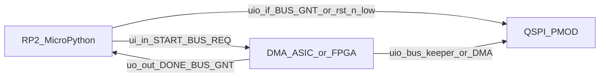

# Firmware Architecture (verbose)

Verbose twin of [`../human/architecture/firmware.md`](../human/architecture/firmware.md). Same section order. Human stays condensed but complete; this file elaborates APIs, sequences, clone paths, chunk formulas, and REPL examples. Do not treat this file as a private second source of truth: every durable requirement here appears in the human doc in some form.

Related frozen contracts: TCD format [`04-tcd-and-datapath.md`](04-tcd-and-datapath.md), QSPI/PSRAM opcodes and `tCEM` [`05-qspi-psram.md`](05-qspi-psram.md), host OE / START [`03-architecture.md`](03-architecture.md), decisions D17 / D20 / D22 / D23 / D24 / D25 / D26 / D28 / D30 / **D34**. QSPI PMOD SPI guide: [PDF](../datasheets/pdfs/Using_QSPI_TinyTapeout.pdf), [extracted notes + code catalog](../datasheets/md/Using_QSPI_TinyTapeout.md).

## Purpose / scope

This document specifies **MicroPython demoboard firmware** for programming the scatter-gather DMA on the Tiny Tapeout **ETR** demoboard (RP2350B) with dual APS6404L-class PSRAM.

| In | Out |
|---|---|
| V1 bulk memcpy via 11-byte TCDs, dual-device, `QUIT` end-of-chain | Cocotb ASIC tests under `test/` |
| SPI bring-up, QPI install/dump after Enter Quad, Exit Quad `0xF5`, TCD tools, one demo | Treating IHP PDK / LibreLane template docs as MCU APIs |
| Host-side pytest of pure firmware logic (`firmware/tests/`) | `firmware/cases.py`, a second demo script, per-`TC-*` builders |
| Local SDK clone [`tt-micropython-firmware/`](../../tt-micropython-firmware/); ETR QSPI PMOD `PIOSPI` + 4-bit QPI catalog | Copying TinyDMA-2C UART FPGA scripts (prior art only; attribute if mentioned) |
| Copied `firmware/tcd.py` / `firmware/chain.py` | Any `from test...` / `import test` under `firmware/` including tests |

**Boundary vs sim host:** [`test/common/host.py`](../../test/common/host.py) is the cocotb-side programming helper. It shares intent (grant, START hold, TCD rules) but is not demoboard MicroPython and must not be imported from MCU code.

**Prior art:** Per TinyDMA-2C (Andrew Kim, TT 296), UART-driven FPGA scripts exist in a separate prior-art dump. They are not this project's MCU design and must not be copied into `firmware/`.



## Platform stack

Primary clone in this repo: [`tt-micropython-firmware/`](../../tt-micropython-firmware/) (remote: TinyTapeout/tt-micropython-firmware; gitignored supporting clone). Do not vendor SDK sources into `firmware/`. Supporting TT clones (`tinytapeout-sky-26c/`, `ttihp-verilog-template/`) are not MCU architecture truth.

### Install and REPL

There is **no compile** of this project's Python. The RP2 already runs MicroPython from a UF2. Project firmware is copied onto the MCU filesystem and imported.

1. One-time OS: hold demoboard boot, copy a SDK **UF2** from TinyTapeout/tt-micropython-firmware releases (includes MicroPython + `ttboard` + default `config.ini`).
2. Serial REPL on the USB CDC port (`/dev/ttyACM0` under WSL).
3. Copy this repo's tree:

```text
pip install --user mpremote
mpremote fs cp -r firmware :/firmware
mpremote reset
```

4. REPL: enable the design (`tt.shuttle.tt_um_lahnb_sgdma.enable()` or load an M7 `.bin` under `/bitstreams`), then `import firmware.demo as demo; demo.main()`.
5. Optional `config.ini`: `mode = ASIC_RP_CONTROL`, `clock_frequency = 66e6`, default project. After `config.ini` edits, `mpremote reset`.

After `mpremote` sessions the board may be suspended; `mpremote reset` reloads `config.ini` and resumes.

### DemoBoard entry

Boot path is SDK `src/main.py` -> `DemoBoard.get()` (commonly bound as `tt` in the REPL). Useful attributes:

| Attribute | Use |
|---|---|
| `tt.shuttle.<design>.enable()` | Mux-select and enable this project's ASIC (or FPGA bitstream stand-in) |
| `tt.ui_in` / `tt.uo_out` | Host control / status (ASIC point of view: MCU writes inputs, reads outputs) |
| `tt.uio_in` / `tt.uio_out` / `tt.uio_oe_pico` | Shared QSPI nets and RP2 OE |
| `tt.clock_project_PWM(freq)` / config `clock_frequency` | Project `clk` (target 66 MHz, D16) |
| `tt.reset_project(True/False)` | Drive `rst_n` (active-low; SDK naming may be `nRESET`-style - confirm against `demoboard.py` when coding) |

`firmware/asic.py` `Host.enable_project` mux-selects `tt_um_lahnb_sgdma` (or an M7 bitstream name), clocks **66 MHz**, and forces unused `ui_in` bits to 0. Mode `ASIC_RP_CONTROL` is the expected `config.ini` setting.

### Modes (`config.ini`)

| Mode | Intent |
|---|---|
| `SAFE` | All RP2 pins inputs |
| `ASIC_RP_CONTROL` | MCU drives `ui_in`, clock, reset; monitors `uo_out` - **default for DMA firmware** |
| `ASIC_MANUAL_INPUTS` | Manual board switches; firmware clock/input APIs largely ignored |

Project sections may set `clock_frequency`, `rp_clock_frequency`, `ui_in`, `uio_oe_pico`, `uio_in`, and `mode`. See SDK [`config.md`](../../tt-micropython-firmware/config.md). Bidirectional pins reset to inputs when enabling another project.

### FPGA bitstream path (M7)

SDK FPGA breakout support: place suitably built `.bin` files under `/bitstreams` on the RP2 filesystem. On boot, `tt.shuttle` exposes them analogously to ASIC projects. M7 loads synthesizable RTL onto that FPGA stand-in in the ASIC's connector position with the same MCU and dual PSRAM PMOD (D28; [`verification/01-strategy.md`](verification/01-strategy.md)).

```text
mpremote fs cp build/design.bin :/bitstreams/tt_um_lahnb_sgdma.bin
```

Then enable it like a shuttle project. Same MCU firmware drives START against FPGA or ASIC.

## Board / pin model

Frozen host pins (D14 / D18 / D22 / D23):

| Pad | Signal | Firmware |
|---|---|---|
| `ui_in[0]` | START | Rising edge after sync -> one-`clk` pulse; hold raw level across the two-flop sync, then deassert |
| `ui_in[2]` | BUS_REQ | Level; assert before enabling MCU QSPI OE |
| `uo_out[0]` | DONE | High = ASIC idle (not a drive permit) |
| `uo_out[1]` | BUS_GNT | High = MCU may drive `uio` (also legal while `rst_n=0`; D26) |
| `ui_in[1]`, `ui_in[7:3]`, `uo_out[7:2]` | Unused (tied 0; D34) | Drive unused inputs low; ignore reads of `[7:2]` |

QSPI on `uio[7:0]` matches the community flash+PSRAM PMOD map ([`../human/architecture/system.md`](../human/architecture/system.md)):

| `uio` | Net |
|---|---|
| 0 | Flash CS |
| 1 | SIO0 / MOSI |
| 2 | SIO1 / MISO |
| 3 | SCK |
| 4 | SIO2 |
| 5 | SIO3 |
| 6 | RAM A CS |
| 7 | RAM B CS |

### `uio_oe_pico` polarity

From SDK `config.md`: **`uio_oe_pico` bits set to 1 are driven by the RP2**. Bit 0 = flash CS OE, bit 3 = SCK OE, etc. Firmware must:

1. Keep `uio_oe_pico = 0` (all inputs / Hi-Z) whenever `rst_n=1` and `BUS_GNT=0`.
2. In a legal drive window (`BUS_GNT=1` or `rst_n=0`), enable the pins needed for the current SPI/QPI phase.
3. Clear OE **before** dropping `BUS_REQ`.

TT `uio_oe` on the ASIC side is independent. Contention = both masters enabled with disagreeing levels.

### SPI pin binding (ETR; from QSPI PMOD guide)

Authoritative demoboard SPI usage and **reusable code catalog**: [`../datasheets/md/Using_QSPI_TinyTapeout.md`](../datasheets/md/Using_QSPI_TinyTapeout.md) (transcribed from the Tiny Tapeout guide; PDF may be image-only). This project targets the **ETR** demoboard. The guide's working 1-bit master is custom **PIO SPI** (`PIOSPI`); it imports `machine.SPI` but does not use HW SPI for transfers. Project firmware adapts that plus a 4-bit QPI PIO (guide `qspi_read` as starting point). Attribution: **Rohan Verma** (github.com/rohanverm94) ETR appendix.

ETR `uio` -> GPIO:

| `uio` | GPIO | Net |
|---|---|---|
| 0 | 25 | Flash CS |
| 1 | 26 | SD0 / MOSI |
| 2 | 27 | SD1 / MISO |
| 3 | 28 | SCK |
| 4 | 29 | SD2 (was WP) |
| 5 | 30 | SD3 (was HOLD) |
| 6 | 31 | RAM A CS |
| 7 | 32 | RAM B CS |

```python
QSPI_BASE = 25
PIN_FLASH_CS = QSPI_BASE + 0
PIN_MOSI     = QSPI_BASE + 1
PIN_MISO     = QSPI_BASE + 2
PIN_SCK      = QSPI_BASE + 3
PIN_SD2      = QSPI_BASE + 4
PIN_SD3      = QSPI_BASE + 5
PIN_RAM_A_CS = QSPI_BASE + 6
PIN_RAM_B_CS = QSPI_BASE + 7
```

Legacy TT04+ boards use the same logical order on GPIO21..28 (not this project's primary target). Hold all CS high when idle; only one CE# low per txn. Flash CS stays high during PSRAM traffic.

## Bring-up

Full ordered sequence for a cold demoboard session (ASIC silicon or M7 FPGA):

1. **Optional M7:** `mpremote fs cp build/design.bin :/bitstreams/tt_um_lahnb_sgdma.bin`.
2. REPL: `tt = DemoBoard.get()` (or use the prebound `tt`).
3. `Host(tt).enable_project()` (mux-select, 66 MHz, unused `ui_in` bits 0, OE Hi-Z).
4. Ensure `rst_n` is asserted briefly, then deassert. Expect `DONE=1`, `BUS_GNT=0`.
5. Confirm MCU `uio_oe_pico = 0`. ASIC is bus keeper: CS high, SCK low (D26).
6. `request_bus` (`ui_in[2]=1`), wait until `uo_out[1]==1`, then OE may go live.
7. `Psram.bring_up_both()`: `tPU`, SPI `0x66`/`0x99`, Enter Quad `0x35` on both devices.
8. QPI-write the `MemoryImage`; Hi-Z; drop REQ; wait grant low; `pulse_start`; wait DONE low then DONE high.
9. Grant; QPI-dump dest extents; compare `interpret_chain` `final_memory`. Optional `exit_qpi`.

## Bus ownership

API-shaped restatement of the human contract (D22 / D23 / D26). Normative OE matrix: human [`blocks/host-interface.md`](../human/architecture/blocks/host-interface.md). Implemented in `firmware/asic.py` (`Host`).

```python
def request_bus(self, timeout_ms=1000, oe=OE_QPI) -> None:
    """Assert BUS_REQ; wait BUS_GNT; then enable MCU QSPI OE if requested."""

def release_bus(self) -> None:
    """Hi-Z first, drop BUS_REQ, wait BUS_GNT=0."""

def pulse_start(self, hold_us=1) -> None:
    """Require DONE=1 and BUS_REQ=0; hold START across the two-flop sync.
    Do not raise BUS_REQ until DONE falls."""

def kill_dma(self) -> None:
    """Assert rst_n; leave MCU OE Hi-Z; caller re-enters QPI after deassert."""
```

### Rules (binding)

1. MCU QSPI Hi-Z unless `BUS_GNT=1` or `rst_n=0` (D26).
2. Access PSRAM/flash under grant while the design is live; while `rst_n=0` (deselected design / kill hold), MCU drive is also legal without `BUS_GNT`.
3. Before release: finish txn, CE# high, Hi-Z, drop `BUS_REQ`, wait `BUS_GNT=0` before START.
4. Both PSRAMs in QPI before START (MCU Enter Quad; ASIC emits no `0x35`/`0xF5`/`0x66`/`0x99` - D17).
5. START only while `DONE=1` and `BUS_REQ=0`; hold across sync; a START edge while busy or while `BUS_REQ=1` is **ignored and not queued**.
6. After pulsing START, do **not** assert `BUS_REQ` until `DONE` has fallen. Overlapping `BUS_REQ` with the START hold window (before DONE drops) is a host race: post-sync IDLE priority can discard the START pulse or accept START and stall at `NEW_FETCH`. `DONE` falling is the ACK that START was accepted.
7. `DONE` is not a drive permit.
8. Mid-run `BUS_REQ` pauses after the current QPI txn; runaway kill = `rst_n` only (no soft abort).

Board **10 kΩ** CS pull-ups cover reset / pre-enable when MCU is not driving CS; do not rely on them alone while the design is live (`rst_n=1`) and `~BUS_GNT`.

Timeouts in `wait_busy` / `wait_done` / `request_bus` call `kill_dma`.

## PSRAM QPI driver

### Transport policy (D30; ETR QSPI PMOD guide)

| Preference | Detail |
|---|---|
| SPI bring-up | 1-bit **PIO SPI** (`PIOSPI` / `spi_cpha0`) from the ETR appendix (Rohan Verma) |
| QPI install/dump | 4-bit PIO path (guide `qspi_read` as starting point; add write and a 2-SCK `0xF5`) |
| Default SCK | **20 MHz** (planner refuses a rate that cannot fit one payload byte under `tCEM`) |
| CS | Separate GPIO per device; all high when idle; never two CE# low; flash CS stays high |
| Not primary | SoftSPI or HW `machine.SPI` |
| CPython | `rp2` imported behind a guard; tests inject a mock transport |
| Flash QE | **Not required.** First-party PMOD ships with flash Quad Enable set (D30) |

ETR scripts also call `machine.freq(150_000_000)` so PIO dividers are deterministic. Optional; the library does not force it (USB CDC can be sensitive). Optional guide flag `DISABLE_TT_ASIC` selects chip ROM so bidirs are inputs for MCU SPI when no design is driving - consistent with D26 MCU-safe drive while `rst_n=0`.

**Guide vs project device modes:**

- **Flash QE:** shipping first-party hardware already has Quad SPI enabled; no firmware/ASIC intervention to enable or disable flash QSPI mode (D30).
- **APS6404L:** guide `test_psram` stays in SPI (`0x02`/`0x03` only). Project firmware must still run `0x66`/`0x99` then `0x35` before START (D17), then switches the MCU master to QPI for install/dump.
- Guide flash `qspi_read` PIO is the **starting point** for MCU PSRAM QPI, not a flash-QE tool.

### MCU opcode set

| Opcode | Bus | Notes |
|---|---|---|
| `0x66` | SPI | Reset Enable; must be followed immediately by `0x99` |
| `0x99` | SPI | Reset; wait `tRST` (>=50 ns) then next cmd |
| `0x35` | SPI | Enter Quad; SPI -> QPI |
| `0xF5` | QPI | Exit Quad; 4-bit opcode, 2 SCK |
| `0xEB` | QPI | Fast Read Quad; 24-bit addr; 6 dummy cycles; MCU dump |
| `0x02` | QPI | Write; 24-bit addr; MCU install |

ASIC DMA uses QPI `0xEB` / `0x02` only (D15/D17). MCU uses the same data opcodes after enter.

### Per-device bring-up sequence

For each of PSRAM A (device 0) and PSRAM B (device 1):

1. CE# high >= `tPU` (150 us) after power / long reset.
2. Under grant: `0x66` then immediately `0x99` on that CS.
3. Wait `tRST`.
4. Issue `0x35` (Enter Quad).
5. Leave CE# high. Device is now QPI; further MCU SPI opcodes are invalid until Exit Quad or reset.

`firmware/psram.py` helpers: `spi_reset`, `enter_qpi`, `exit_qpi`, `write` / `read` (always chunked), `bring_up_both`.

### REPL sketch

```python
>>> from firmware.asic import Host
>>> from firmware.psram import Psram, make_board_transport
>>> from firmware.build import add_copy, add_quit, new_image, place_bytes
>>> from firmware.runner import run_chain
>>> host = Host(tt); host.enable_project()
>>> psram = Psram(make_board_transport())
>>> mem = new_image()
>>> add_copy(mem, 0, 0, src_ptr=0x100, dest_ptr=0x200, length=8, next_tcd=0x0B)
>>> add_quit(mem, 0, 0x0B)
>>> place_bytes(mem, 0, 0x100, b"01234567")
>>> ok, result, mismatches = run_chain(host, psram, mem, exit_qpi=True)
```

Custom chains are built this way. Firmware does not ship a factory per directed-test ID.

## tCEM / chunking

### Why firmware must chunk

Device physics (APS6404L Table 10 class; [`05-qspi-psram.md`](05-qspi-psram.md) only - MCU chunk policy is not an ASIC D20 rule):

| Symbol | Binding for MCU QPI planning |
|---|---|
| `tCEM` | Max CE# low: **4 us** extended-grade default (8 us standard grade) |
| `tCPH` | Min CE# high between bursts: 18 ns (trivial at MCU rates) |
| `tPU` / `tRST` | 150 us / 50 ns |

ASIC V1 `N=1` keeps DMA CE# pulses short (D20 contrast only). **MCU QPI** can still hold CE# across a long `0xEB`/`0x02` burst, so firmware must slice payloads. Never single-CE# a multi-kilobyte dump.

### Chunk-size formula (QPI)

SCK budget in one CE# pulse, with 25% unused margin:

```text
# 0xEB: 2 cmd + 6 addr + 6 dummy + 2*nbytes SCK
# 0x02: 2 cmd + 6 addr + 2*nbytes SCK
bits_budget = TCEM_US * 1e-6 * f_SCK * (1 - 0.25)
nbytes_max_eb = floor((bits_budget - 14) / 2)
nbytes_max_02 = floor((bits_budget - 8) / 2)
```

`bits_budget` here is SCK cycles (`f_SCK * tCEM * (1 - margin)`). If `nbytes_max < 1`, refuse that SCK. At the default **20 MHz** / 4 us / 25% margin: `nbytes_max_eb = 23`, `nbytes_max_02 = 26`.

**Note on the PMOD guide:** helpers often transfer **8 bytes at 10 MHz** in 1-bit SPI, which can exceed extended-grade `tCEM` (4 us). Treat the guide as a **functional pin/PIO pattern**, not a refresh-safe burst length.

Also enforce ASIC firmware-facing limits when building TCDs: `TRANSFER_LEN <= 255`, address spans on `ptr[22:0]` inside `0x000000..0x7FFFFF` (`ptr[23]` don't-care; D35), release-before-seize.

## TCD install

### Serialization (D25 / D24)

Copied `encode_tcd` / `decode_tcd` / `validate_tcd` in `firmware/tcd.py` are the contract (`TC_TCD_BE_BYTES` lives in that copy). 11-byte big-endian layout:

| Offset | Field |
|---|---|
| 0..2 | `SRC_PTR` MSB-first |
| 3..5 | `DEST_PTR` |
| 6 | `TRANSFER_LEN` |
| 7..9 | `NEXT_TCD` |
| 10 | `CTRL_FLAGS`: bit7 `NEXT_DEVICE`, bit6 `DEST_DEVICE`, bit5 `SRC_DEVICE`, bit4 `QUIT`, bits 3:0 = 0 (reserved; firmware writes 0; ASIC latches them, V1 control ignores them) |

Mechanical copy only: relative import and optional `_compat.py` dataclass shim. Do not rewrite `interpret_chain`. Recopy from `test/reference/` when the 11-byte TCD contract changes; do not add a pytest that imports `test/` to detect drift.

### `build.py` helpers

Thin layer so REPL/scripts do not hand-place bytes:

- `place_tcd(mem, device, addr, tcd)` - encode, span-check, write 11 bytes
- `place_bytes(mem, device, addr, data)` - payload
- `add_copy(...)` - one data TCD with `SRC`/`DEST`/`LEN`/`NEXT`/`CTRL_FLAGS`
- `add_quit(mem, device, addr)` - `QUIT=1` terminator (address 0 is not a terminator)
- `link(mem, prev_device, prev_addr, next_device, next_addr)` - fill `NEXT_TCD` / `NEXT_DEVICE`
- Head convention: first TCD (or quit-for-empty) at **PSRAM 0, `0x000000`**

Then `interpret_chain(mem)` is the golden. Sparse dict storage; do not allocate 8 MB.

### Install sequence under grant (`firmware/runner.py`)

```text
result = interpret_chain(initial_memory)
request_bus -> enter_qpi both -> QPI write image
release_bus -> pulse_start -> wait DONE low -> wait DONE high
request_bus -> QPI read dest extents -> compare result.final_memory
optional exit_qpi
```

## Debug helpers

`firmware/debug.py` (chunked QPI, never an unchunked dump):

```python
def dump(psram, cs, addr, length, width=16) -> None: ...
def peek(psram, cs, addr, n=1) -> bytes: ...
def poke(psram, cs, addr, data) -> None: ...
def decode_chain(psram, head_addr=0, head_dev=0, max_nodes=64) -> None:
    """Fetch 11-byte records following NEXT_*; stop on QUIT or max_nodes."""
```

Host pins stay on `Host` (`request_bus`, `pulse_start`, `kill_dma`, poll DONE/GNT).

## Module layout

| Path | Role | Depends on `ttboard`? |
|---|---|---|
| `firmware/tcd.py` | Copied pack / unpack / validate | No |
| `firmware/chain.py` | Copied `MemoryImage`, `interpret_chain`, `ChainResult` | No |
| `firmware/_compat.py` | Dataclass shim if the UF2 lacks `dataclasses` | No |
| `firmware/build.py` | Thin helpers to assemble arbitrary chains | No |
| `firmware/psram.py` | Reset, enter/exit, QPI `0xEB`/`0x02`, `tCEM` chunking, PIO behind `rp2` | Optional (`rp2` on MCU; mockable) |
| `firmware/asic.py` | `DemoBoard` host protocol | Yes at runtime |
| `firmware/runner.py` | Grant, install, START, wait DONE, dump, compare | Via asic/psram |
| `firmware/debug.py` | Dump / peek / poke / decode | Uses psram |
| `firmware/demo.py` | One pre-built PSRAM0 copy + `QUIT` | Yes at runtime |
| `firmware/tests/` | Host pytest (D30) | No hardware |

No `firmware/cases.py`. Package is importable as `firmware` (`firmware/__init__.py`). Dual-runtime: CPython pytest + MicroPython. No `typing` runtime deps.

## Firmware logic testbench

Host-side **pytest** under `firmware/tests/` (required by D30; no `test/` imports):

| Covered | Not covered |
|---|---|
| `TC_TCD_BE_BYTES` pack / unpack / `QUIT` | Real `DemoBoard` SPI/QPI |
| `build.py` + `interpret_chain` dest bytes | Timing vs APS6404L silicon |
| QPI `tCEM` planner vs `f_SCK`; illegal SCK rejected | M7 HIL |
| Enter `0x35` and exit `0xF5` (2 SCK) frame builders | Contended bus |
| Mock host: START refused while REQ; REQ refused until DONE falls; OE 0 before drop REQ | FPGA bitstream load |
| Mock runner golden compare; `demo.py` vector | |

```text
cd firmware && python -m pytest -q
```

This suite catches serialization, chunking, and host-protocol bugs early. It does **not** replace M7 (D28) or cocotb `test/`.

## Demos / M7

**Process sequencing:** after the cocotb/RTL verification milestones that gate M7 entry are complete, FPGA testing must be ready to run. Demoboard/FPGA bring-up (including this firmware library) is therefore allowed and needed before or as M7 starts. Host-side `firmware/tests` unit logic can start earlier; demoboard HIL remains Phase 3 / M7.

### One canned demo

`firmware/demo.py`: PSRAM0-to-PSRAM0 copy of a short known pattern, linked to a `QUIT` TCD at `0x00000B`, programmed under grant, START, wait DONE, golden compare. Prints `PASS` or `FAIL`. That is the only canned vector.

Everything else is built with `build.py` + `asic.py` + `runner.py` in the REPL or a user script.

### M7 high-value subset

From verification strategy / D28 / D30, driven by real MCU firmware (not cocotb), assembled with the tools (not a per-ID catalog):

- Same-device copies (A->A, B->B)
- Cross-device A->B and B->A
- Multi-TCD chaining
- `QUIT` terminator / empty run (`QUIT` at head)
- Zero-length data TCD (no-op then next)
- Bus handoff (`BUS_REQ` mid-run pause / resume)
- Reset recovery (`rst_n` kill + re-QPI + rerun)

Retain scripts and vectors with the RTL revision they validated. M7 does not close IHP pad `T-*` rows.

## Recovery

| Symptom | Action |
|---|---|
| DONE never returns | `kill_dma` / `rst_n`; Hi-Z MCU; after deassert, grant -> SPI reset + Enter Quad both -> reinstall or retry |
| Need SPI after QPI run | Grant -> `0xF5` (if still QPI) or `0x66`/`0x99` |
| Suspected OOR / bad chain | Validate before START (D34); if violated at runtime, behavior undefined; recover with `rst_n` |

Unused host bits tied 0 (D34). START hold: long enough for two-flop sync at 66 MHz (`Host.pulse_start` default 1 us).

## Sim relationship

| Tree | Role |
|---|---|
| `firmware/` | Demoboard MicroPython + PC unit tests |
| `test/common/host.py` | Cocotb stimulus helpers |
| `test/tests/` | ASIC / engine sim regression |

Shared **intent** only: grant before drive, big-endian TCD, fixed head, `QUIT`, `rst_n` kill. Separate implementations; firmware must not import `test/`.

## Non-goals (V1 firmware)

- No `firmware/cases.py`, no one function per `TC-*` ID, no second demo script
- No import of `test/` from firmware or firmware tests
- No ASIC flash DMA; flash is MCU pass-through under grant (D11/D26); no flash QE enable/disable in bring-up (D30)
- No ALU / cond-stop / ring / soft abort (kill = `rst_n`, D23)
- No copying TinyDMA-2C prior-art firmware

## See also

- Human twin: [`../human/architecture/firmware.md`](../human/architecture/firmware.md)
- System / MCU setup: [`../human/architecture/system.md`](../human/architecture/system.md)
- Host interface: [`../human/architecture/blocks/host-interface.md`](../human/architecture/blocks/host-interface.md)
- PSRAM opcodes / `tCEM`: [`05-qspi-psram.md`](05-qspi-psram.md)
- Decision log: D17, D20, D22-D26, D28, D30, D34 in [`07-decision-log.md`](07-decision-log.md)
- M7: [`verification/01-strategy.md`](verification/01-strategy.md)
- QSPI PMOD SPI guide: [PDF](../datasheets/pdfs/Using_QSPI_TinyTapeout.pdf), [ETR notes + code catalog](../datasheets/md/Using_QSPI_TinyTapeout.md)
- SDK: [`../../tt-micropython-firmware/README.md`](../../tt-micropython-firmware/README.md), [`config.md`](../../tt-micropython-firmware/config.md)
